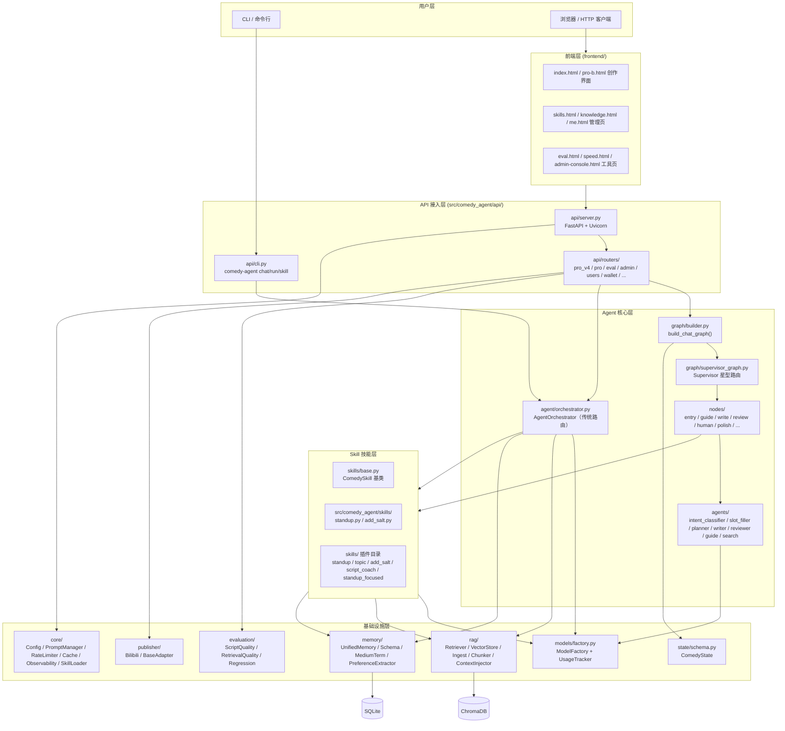
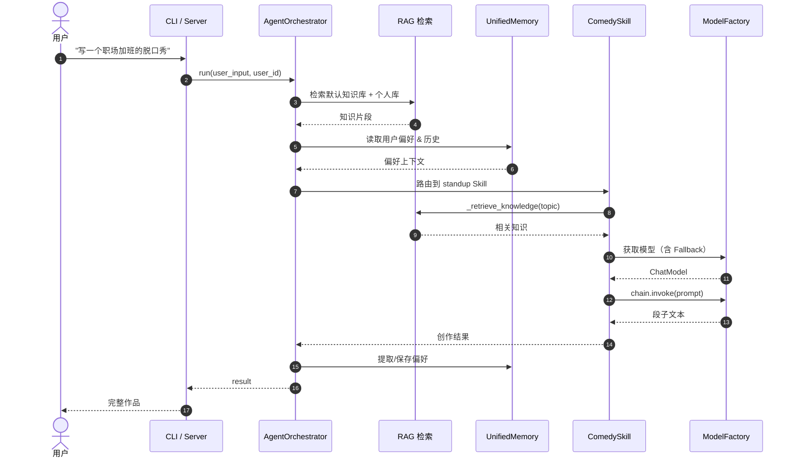
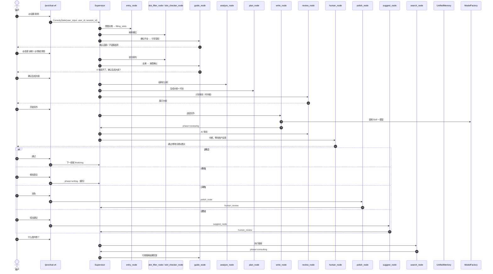

# Comedy Agent 项目整体架构（当前实现）

> 本文档基于当前代码树、README、pyproject.toml 及既有架构文档整理，反映截至目前的实现状态，用于快速了解项目全貌。
>
> 相关前置文档：
> - `comedy-agent-design.md` — 设计方案与核心问题
> - `plan.md` — 五阶段开发计划
> - `docs/architecture.md` — 早期系统架构图
> - `docs/v4-architecture-workflow.md` — v4 专业版多 Agent 工作流
> - `README.md` — 功能、CLI/API、快速开始

---

## 1. 项目概述

**Comedy Agent** 是一个面向喜剧行业的垂直 Agent 框架，基于 Python + LangChain / LangGraph 构建，目标是提供“从用户需求到喜剧作品生成”的一体化创作辅助能力。

- **定位**：喜剧创作助手（脱口秀、相声、小品、漫才、短剧等）+ 学习/评估/发布工具。
- **入口**：命令行（CLI）、FastAPI HTTP 服务、纯前端 HTML 页面。
- **核心能力**：多模型接入、RAG 知识库检索、个性化记忆、插件化 Skill、v4 专业版多 Agent 创作流程。
- **版本**：`0.1.0`（`pyproject.toml`）。

---

## 2. 技术栈

| 层级 | 主要技术 |
|------|----------|
| 语言 / 构建 | Python ≥3.11，setuptools，pyproject.toml |
| Agent 框架 | LangChain、LangGraph（StateGraph / Supervisor） |
| HTTP 服务 | FastAPI + Uvicorn |
| CLI | argparse，入口 `comedy-agent` |
| 模型接入 | OpenAI、Anthropic、Moonshot/Kimi、通义千问、Ollama、万界数据（WJark）等 |
| Embedding | OpenAI `text-embedding-3-large/small`、本地 HuggingFace `all-MiniLM-L6-v2` |
| 向量数据库 | ChromaDB（持久化） |
| 记忆存储 | SQLite + SQLModel（`data/memory.db`），可选 Redis 缓存/限流 |
| 文档解析 | Unstructured + 自定义 DocumentLoader（PDF/Word/网页/文本/字幕） |
| 检索增强 | 向量检索 + BM25 + Cross-Encoder 重排序 + 上下文注入 |
| 可观测性 | LangSmith + 自研 `Tracer`/`Metrics` |
| 测试 | pytest，pytest-asyncio（约 402 个用例） |
| 部署 | Docker、docker-compose、部署脚本 |

---

## 3. 物理目录结构

```
cd-agent/
├── src/comedy_agent/          # 核心源码（Python 包）
│   ├── agent/                 # 传统 Orchestrator：AgentOrchestrator
│   ├── agents/                # v4 各类 Agent：supervisor、writer、planner、reviewer、guide、search...
│   ├── api/                   # CLI、FastAPI Server、路由、中间件、计费
│   │   └── routers/           # 业务路由：pro/pro_v4/salt/speed/eval/admin/users/wallet...
│   ├── auth/                  # 认证、依赖、安全
│   ├── checkpoints/           # LangGraph checkpoint 持久化（HybridSqliteSaver）
│   ├── core/                  # 配置、PromptManager、缓存、限流、SkillLoader、知识蒸馏、样例格式化
│   ├── evaluation/            # 剧本/检索/模型质量评估、回归测试、报告
│   ├── graph/                 # LangGraph 构建器、Supervisor 图、状态修饰器、边
│   ├── memory/                # 记忆 Schema、UnifiedMemory、中期记忆、偏好提取、存储
│   ├── models/                # ModelFactory、UsageTracker
│   ├── nodes/                 # v4 LangGraph 节点：entry/guide/write/review/human/polish/...
│   ├── publisher/             # 多平台发布适配器（B 站等）
│   ├── rag/                   # RAG 检索：文档加载、分块、Retriever、VectorStore、上下文注入、反馈回流
│   ├── skills/                # 内置 Skill 代码：base/standup/add_salt/loader
│   ├── state/                 # v4 ComedyState Schema
│   ├── tools/                 # 理论工具（Theory Tools）
│   └── utils/                 # 消息处理、摘要
│
├── frontend/                  # 静态前端页面（HTML + CSS + JS）
│   ├── index.html             # 创作主页面
│   ├── pro-b.html             # 专业版 B 主界面
│   ├── skills.html, knowledge.html, me.html 管理页
│   ├── eval.html, speed.html, admin-console.html, login.html, ip-role.html ...
│   └── common.js / common.css
│
├── skills/                    # 插件化 Skill 目录（声明式 + 可选代码）
│   ├── standup/               # 脱口秀 Skill（v4 主 Skill）
│   ├── topic/                 # 话题引导 Skill
│   ├── add_salt/              # 加梗 Skill
│   ├── script_coach/          # 教练陪写 Skill
│   └── standup_focused/       # 聚焦版脱口秀 Skill
│
├── data/                      # 数据与状态文件
│   ├── memory.db              # SQLite 记忆数据库
│   ├── prompts/               # 外部 Prompt 模板（含 pro 子目录）
│   ├── knowledge/             # 默认知识库语料（cases / theory）
│   ├── uploads/               # 用户上传文档
│   └── write-output/          # 创作输出
│
├── chroma_data/               # ChromaDB 向量库持久化数据
│
├── tests/                     # 测试集（80+ 测试文件，约 402 用例）
│
├── scripts/                   # 运维/数据脚本：ingest、迁移、seed、测试 Ollama
│
├── docs/                      # 架构与流程文档
├── deploy/                    # 部署脚本与说明
├── examples/                  # 样例数据
├── vibe-log/                  # 任务执行日志
├── pyproject.toml             # 项目依赖与入口
├── docker-compose.yml
└── .env / .env.example        # 环境变量
```

---

## 4. 分层架构



---

## 5. 核心调用链路

### 5.1 传统单次创作链路（Orchestrator）



### 5.2 v4 专业版多 Agent 创作链路（/pro/chat-v4）



---

## 6. v4 创作工作流状态机

### 6.1 核心状态 `ComedyState`

定义在 `src/comedy_agent/state/schema.py`，由 Pydantic 校验，贯穿整个 LangGraph。

| 字段 | 说明 |
|------|------|
| `phase` | 当前阶段：idle / chatting / consulting / filling_slots / analyzing / planning / writing / reviewing / human_review / polishing / suggesting / searching / finalizing / complete 等 |
| `session_id` / `user_id` | 会话与用户标识（thread_id） |
| `user_input` / `output` | 用户输入与 Agent 输出 |
| `messages` | LangChain 消息链 |
| `intent` | 意图：writing / fill_slot / control / search / feedback / consult / chat |
| `slots` / `active_slot_dimension` / `slot_conversations` | 四维度槽位（话题/态度/偏见/情绪）及对话历史 |
| `analysis` / `plan` | 上下文分析结果与创作大纲 |
| `current_section` / `sections` | 逐段写作索引与已完成段落 |
| `review` / `feedback` | 审阅结果与人类反馈 |
| `knowledge_context` / `knowledge_references` | 注入的知识上下文 |
| `search_results` | 未知名词搜索结果 |
| `response_type` / `suggested_actions` | 前端响应类型与 A/B/C 选项 |
| `duration` | 预期时长（分钟） |
| `skill_meta` / `selected_skill` / `selected_style` | Skill 元信息 |

### 6.2 节点一览

所有节点位于 `src/comedy_agent/nodes/`，对应 v4 工作流中的具体步骤：

| 节点 | 文件 | 职责 |
|------|------|------|
| 入口 | `entry_node.py` | 意图分类（@填槽 / 搜索 / 创作口令 / LLM 分类） |
| 槽位填充 | `slot_filler_node.py` | 解析 `@维度 内容` 并写入 `slots` |
| 槽位检查 | `slot_checker_node.py` | 判断槽位是否足够进入下一阶段 |
| 引导 | `guide_node.py` | 缺失槽位引导、满意确认、闲聊回复 |
| 分析 | `analyze_node.py` | 基于槽位输出结构化 `analysis` |
| 规划 | `plan_node.py` | 生成大纲 `todo` + `outline` + `tone` |
| 计划审阅 | `plan_review_node.py` | 展示大纲并中断等待用户确认 |
| 计划反馈处理 | `process_plan_feedback_node.py` | 处理用户对大纲的修改/确认 |
| 写作 | `write_node.py` | 调用 Skill 逐段生成 |
| 草稿 | `draft_node.py` | 样例引导+用户输入模式（已废弃，保留兼容） |
| 示例 | `example_node.py` | 生成候选示例供选择 |
| 审阅 | `review_node.py` | AI 审阅当前段落 |
| 人工审阅 | `human_node.py` | 中断并等待人类反馈 |
| 反馈处理 | `process_feedback_node.py` | 分发通过/修改/润色/建议/人工编辑 |
| 润色 | `polish_node.py` | 对段落润色 |
| 建议 | `suggest_node.py` | 对用户段落给出改进建议 |
| 搜索 | `search_node.py` | 未知名词 DuckDuckGo 搜索 |
| 聊天 | `chat_node.py` | 普通闲聊 |
| 收尾 | `finalize_node.py` | 组装最终稿件 |

### 6.3 Agent 一览

所有 Agent 类位于 `src/comedy_agent/agents/`，被节点调用：

- `supervisor.py` — SupervisorAgent，按 `phase` 路由
- `intent_classifier.py` — IntentClassifierAgent
- `slot_filler.py` / `slot_checker.py` — 槽位解析与检查
- `guide.py` — GuideAgent，引导对话
- `context_analyzer.py` — ContextAnalyzerAgent
- `planner.py` — PlannerAgent
- `writer.py` — WriterAgent
- `reviewer.py` — ReviewerAgent
- `search.py` — SearchAgent

---

## 7. RAG 知识库数据流

```mermaid
flowchart LR
    subgraph Input["输入"]
        PDF["PDF / Word"]
        Web["网页 / 文本"]
        Sub["SRT / VTT / ASS 字幕"]
    end

    subgraph Ingest["解析入库 (rag/ingest.py)"]
        Loader["DocumentLoader"]
        Chunker["文本分块<br/>保留时间码/元数据"]
        Embed["Embedding 模型"]
    end

    subgraph Storage["存储"]
        DefaultDB[(默认库 comedy_knowledge)]
        UserDB[(个人库 user_knowledge_{uid})]
    end

    subgraph Retrieval["检索 (rag/retriever.py)"]
        Vec["向量检索"]
        BM25["BM25 关键词检索"]
        Merge["合并去重"]
        Rerank["Cross-Encoder 重排序"]
    end

    subgraph Consume["消费"]
        AgentSys["Agent System Prompt"]
        SkillSys["Skill System Prompt"]
    end

    Input --> Loader --> Chunker --> Embed
    Embed --> DefaultDB & UserDB
    DefaultDB & UserDB --> Vec
    Vec --> Merge
    BM25 --> Merge
    Merge --> Rerank
    Rerank --> AgentSys & SkillSys
```

---

## 8. 子系统详解

### 8.1 API 接入层 `src/comedy_agent/api/`

- `cli.py` — `comedy-agent` 命令行入口，支持 `chat`、`run`、`skills`、`skill <name>`。
- `server.py` — FastAPI 服务入口，包含生命周期管理（加载 Prompt、Memory、Retriever、Orchestrator、Graph）。
- `middleware.py` — 限流中间件（Redis 优先，降级内存）。
- `billing.py` — Token 计费与用量追踪。
- `state.py` — 服务运行时状态对象。
- `routers/` — 业务路由：
  - `pro_v4.py` — `/pro/chat-v4` 专业版 B 主接口
  - `pro.py` — `/pro/*` 专业版 A（Persona、Skill、上传）
  - `eval.py` — 评估广场与打分 `/eval/*`、`/square/*`
  - `salt.py` — 加梗 `/salt`
  - `speed.py` — 语速/润色 `/speed/*`
  - `ip_styles.py` — IP 风格/角色 `/ip-styles`、`/ip-roles`
  - `users.py` / `wallet.py` — 用户关注、钱包、消费、个人中心
  - `projects.py` — 创作项目管理
  - `submissions.py` / `export.py` — 作品投稿与导出
  - `publish.py` — 多平台发布（B 站登录/上传/发布）
  - `annotations.py` — 数据标注与反馈消息
  - `admin.py` — 后台概览、Skill 审核、IP 管理、敏感词、认证审核
- `auth/` — 登录/注册、JWT/Session 依赖、权限校验。

### 8.2 Agent 核心层

- `agent/orchestrator.py` — 传统 AgentOrchestrator，负责注册 Skill、路由用户请求、注入 RAG 与记忆、调用 Skill 并返回结果。
- `graph/builder.py` — `build_chat_graph()`，组装 LangGraph StateGraph。
- `graph/supervisor_graph.py` — Supervisor 路由逻辑，根据 `ComedyState.phase` 决定下一个节点。
- `graph/state_modifier.py` — 组装完整 System Prompt：BASE + Skill prompt + 知识库 + 搜索资料 + 段落上下文。
- `graph/edges.py` — 节点间转移条件。
- `nodes/` — 节点实现（见 6.2）。
- `agents/` — 节点背后的 Agent 类（见 6.3）。
- `state/schema.py` — 全局状态定义。
- `checkpoints/memory.py` — `HybridSqliteSaver` / `CheckpointSaverFactory`，支持会话恢复。

### 8.3 Skill 技能层

- `src/comedy_agent/skills/base.py` — `ComedySkill` 基类，封装 System Prompt、模板渲染、知识检索、LLM 调用。
- `src/comedy_agent/skills/standup.py` — 脱口秀内置代码 Skill。
- `src/comedy_agent/skills/add_salt.py` — 加梗 Skill。
- `src/comedy_agent/skills/loader.py` — 从 `skills/` 目录加载声明式/代码式插件。
- `src/comedy_agent/core/skill_router.py` — Skill 路由与注册。
- `skills/` 插件目录（当前）：
  - `standup/` — 脱口秀创作（v4 主 Skill）
  - `topic/` — 话题引导
  - `add_salt/` — 加梗
  - `script_coach/` — 教练陪写
  - `standup_focused/` — 聚焦版脱口秀

### 8.4 模型层 `src/comedy_agent/models/`

- `models/factory.py` — `ModelFactory`：统一注册 OpenAI / Anthropic / Ollama / Tongyi / Moonshot / WJark 等模型；支持按任务类型（creative/analytical/fast）绑定模型；支持 `get_model_with_fallback()` 自动降级；支持结构化输出 `with_structured_output`；动态探测 Ollama 本地可用模型。
- `models/usage_tracker.py` — 记录每次 LLM 调用的 Token 消耗与费用，用于计费与统计。

支持模型示例：`gpt-4o`、`claude-3-5-sonnet`、`qwen-max`、`kimi-for-coding`、`ollama-llama3.1`、`deepseek-v4-pro`、`glm-5.1` 等。

### 8.5 RAG 知识库 `src/comedy_agent/rag/`

- `document_loader.py` — 多格式文档解析（PDF、Word、网页、文本、字幕）。
- `chunker.py` — 分块策略（fixed / paragraph / scene / dialogue / subtitle），保留元数据。
- `vector_store.py` — ChromaDB 封装。
- `retriever.py` — `ComedyRetriever`，混合检索（向量 + BM25）+ 重排序。
- `context_injector.py` — 将检索结果注入 Prompt。
- `ingest.py` — `KnowledgeIngestor`，文档上传与入库。
- `theory_store.py` — 理论知识库管理。
- `feedback_loop.py` — 高评分作品回流到知识库，实现持续进化。
- `comedy_optimizer.py` — 喜剧检索后处理优化。

### 8.6 记忆系统 `src/comedy_agent/memory/`

- `memory/schema.py` — SQLModel 表结构：UserProfile、Preference、Conversation、Script、TokenAccount 等。
- `memory/unified.py` — `UnifiedMemory`：统一读写会话、偏好、作品、Token 账户。
- `memory/medium_term.py` — 中期记忆（写作约定、用户画像）。
- `memory/preference_extractor.py` — 从对话中自动提取用户偏好。
- `memory/store.py` — 底层存储访问。
- `memory/models.py` — 数据模型（Pydantic / SQLModel）。

### 8.7 核心公共组件 `src/comedy_agent/core/`

- `config.py` — Pydantic Settings，读取 `.env` 配置。
- `prompt_manager.py` — 外部 Prompt 模板热加载。
- `rate_limiter.py` / `cache.py` — 限流与缓存。
- `observability.py` — Tracer / Metrics / LangSmith 集成。
- `skill_loader.py` / `skill_router.py` — Skill 加载与路由。
- `knowledge_system.py` / `knowledge_models.py` / `knowledge_distiller.py` — 知识蒸馏与理论体系。
- `example_retriever.py` / `few_shot_formatter.py` — 样例检索与 Few-shot 格式化。
- `annotation.py` — 标注模型与逻辑。

### 8.8 评估与发布 `src/comedy_agent/evaluation/`、`src/comedy_agent/publisher/`

- `evaluation/script_quality.py` — 剧本质量评估。
- `evaluation/retrieval_quality.py` — 检索相关性评估。
- `evaluation/model_quality.py` — 模型输出评估。
- `evaluation/regression.py` — 回归测试框架。
- `evaluation/report.py` — 评估报告生成。
- `publisher/base_adapter.py` / `bilibili.py` / `publisher.py` — 多平台发布适配器（目前含 B 站）。

---

## 9. 接口清单

### 9.1 CLI 命令

| 命令 | 说明 | 示例 |
|------|------|------|
| `comedy-agent --version` | 版本号 | — |
| `comedy-agent chat` | 交互式对话 | `comedy-agent chat --model gpt-4o` |
| `comedy-agent run "<prompt>"` | 单次运行 | `comedy-agent run "写一段脱口秀"` |
| `comedy-agent skills` | 列出 Skill | — |
| `comedy-agent skill <name>` | 直接调用 Skill | `comedy-agent skill standup --topic "职场"` |

### 9.2 HTTP 接口（按路由分组）

| 路由组 | 主要路径 |
|--------|----------|
| 健康/Skill | `GET /health`、`GET /skills`、`POST /skills/install`、`DELETE /skills/{name}`、`POST /skills/reload` |
| 创作对话 | `POST /chat`、`POST /pro/chat-v4`、`GET /pro/chat-v4/{session_id}` |
| 直接 Skill | `POST /skills/standup` |
| 作品管理 | `POST /scripts`、`GET /scripts`、`GET /scripts/{id}`、`PUT /scripts/{id}`、`DELETE /scripts/{id}`、`PATCH /scripts/{id}/rate` |
| 会话管理 | `GET /conversations`、`GET /conversations/{id}`、`DELETE /conversations/{id}` |
| 文档上传 | `POST /documents/upload`、`GET /documents` |
| 学习/技巧 | `POST /learn/chat`、`POST /learn/cards`、`GET /learn/cards` |
| 高评分回流 | `POST /feedback/ingest` |
| 调试 | `POST /debug/retrieve`、`GET /models`、`GET /preferences` |
| 专业版 | `GET /pro/skills`、`GET /pro/personas`、`POST /pro/personas`、`POST /pro/upload` |
| 评估广场 | `GET /eval/square`、`GET /eval/square/{id}`、`POST /eval/results/{id}/rate` |
| 加梗 | `POST /salt`、`GET /salt/history` |
| 语速润色 | `POST /speed/polish`、`GET /speed/history`、`POST /speed/estimate` |
| IP 风格 | `GET /ip-styles`、`GET /ip-roles`、`POST /ip-roles/{id}/try` |
| 用户/钱包 | `GET /me`、`PUT /me`、`GET /me/wallet`、`POST /me/recharge`、`GET /me/consumptions` |
| 项目管理 | `GET /projects`、`POST /projects`、`PUT /projects/{id}`、... |
| 投稿发布 | `POST /scripts/{id}/submit`、`POST /publish/upload`、`POST /publish/`、B 站登录相关 |
| 认证 | `/auth/*`（注册/登录/重置密码等） |
| 管理后台 | `/admin/overview`、`/admin/skills/*`、`/admin/ip-styles/*`、`/admin/verifications/*` |

> 具体接口定义、请求/响应模型详见 `src/comedy_agent/api/server.py` 与各 `src/comedy_agent/api/routers/*.py`。

---

## 10. 数据存储与外部依赖

| 数据类型 | 存储 | 路径/说明 |
|----------|------|-----------|
| 记忆数据 | SQLite | `data/memory.db`（SQLModel Schema） |
| 向量库 | ChromaDB | `chroma_data/` |
| Prompt 模板 | 文件系统 | `data/prompts/`（含 `pro/` 子目录） |
| 默认知识库 | 文件系统 | `data/knowledge/` |
| 用户上传文档 | 文件系统 | `data/uploads/{user_id}/` |
| 创作输出 | 文件系统 | `data/write-output/` |
| 缓存/限流 | Redis（可选） | 默认 `redis://localhost:6379/0` |
| 外部模型 | 各云 API | OpenAI / Anthropic / Moonshot / 通义 / WJark / Ollama |
| 搜索 | DuckDuckGo | `duckduckgo-search` |
| 可观测性 | LangSmith | 可选 |

---

## 11. 测试与部署

### 11.1 测试

- 测试框架：`pytest` + `pytest-asyncio`。
- 测试文件位于 `tests/`，约 **80+ 文件、402 个用例**。
- 运行：
  ```bash
  python -m pytest tests/ -v
  ```
- 覆盖范围：RAG、Skill、Memory、Graph 节点、API、模型工厂、计费、认证、发布、评估等。

### 11.2 部署

- `Dockerfile` + `docker-compose.yml` 提供容器化部署。
- `deploy/DEPLOY.md` 部署说明。
- `deploy/install-docker.sh` / `install-native.sh` 安装脚本。
- `scripts/start-dev.sh` / `start-prod.sh` 启动脚本。

---

## 12. 关键模块依赖关系

```mermaid
flowchart LR
    cli["api/cli.py"] --> orch["agent/orchestrator.py"]
    srv["api/server.py"] --> orch
    srv --> graph["graph/builder.py"]
    graph --> sup["graph/supervisor_graph.py"]
    sup --> nodes["nodes/*.py"]
    nodes --> agents["agents/*.py"]

    orch --> factory["models/factory.py"]
    orch --> base["skills/base.py"]
    orch --> retriever["rag/retriever.py"]
    orch --> memory["memory/unified.py"]

    nodes --> factory
    nodes --> memory
    nodes --> base
    nodes --> skill_loader["core/skill_loader.py"]
    nodes --> state_modifier["graph/state_modifier.py"]

    skill_loader --> plugins["skills/*/SKILL.md"]
    base --> factory
    base --> retriever
    retriever --> vstore["rag/vector_store.py"]
    ingest["rag/ingest.py"] --> vstore
    ingest --> factory
    memory --> schema["memory/schema.py"]
    factory --> cfg["core/config.py"]
```

---

## 13. 已知边界与演进方向

- **当前保留**：v4 专业版多 Agent 流程（Supervisor 星型图）、逐段写作、人工审阅中断、四维度 `@填槽`、搜索 Agent 自动触发、知识库注入。
- **当前插件 Skill**：`standup`、`topic`、`add_salt`、`script_coach`、`standup_focused`；内置代码 Skill 以 `standup` 和 `add_salt` 为主。
- **已废弃/降级**：`manual_section_mode`（样例引导+用户输入模式）默认关闭；早期部分代码 Skill（相声/小品/漫才等）未在源码中保留，仅在架构历史中描述。
- **未来方向**：中期记忆写作约定、长期用户画像、外部知识库优先级检索、多平台发布完善、评估体系自动化、Redis 缓存与并发优化。

---

*文档维护：当代码结构发生较大变化（新增/删除路由、节点、Skill 或存储）时同步更新本文档。*
