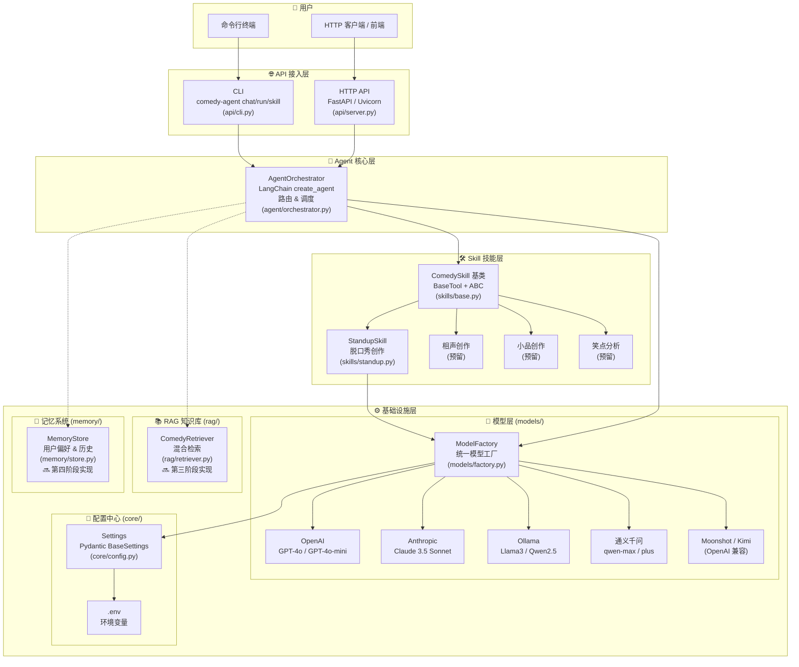
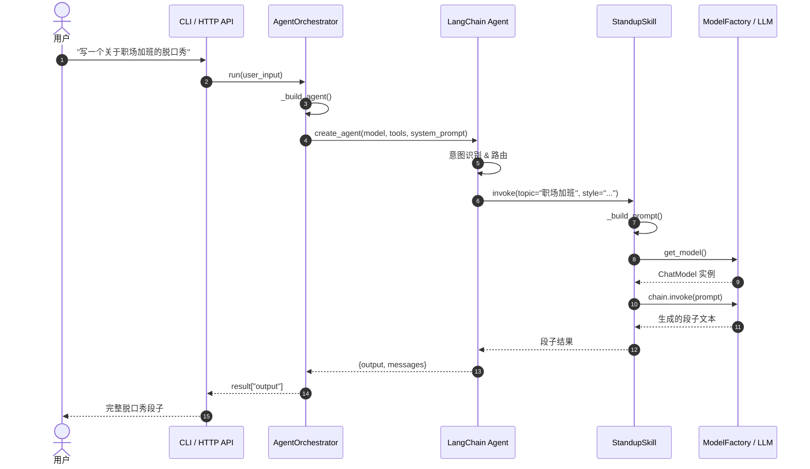
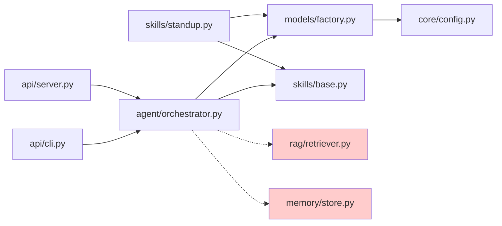

# Comedy Agent 架构图

## 一、系统分层架构

## 二、核心调用链路

## 三、模块依赖关系

> 🔜 标记为红色虚线框/虚线箭头的模块为**预留接口**，将在后续阶段实现。

## 四、技术栈

| 层级 | 技术选型 |
|------|----------|
| Agent 框架 | LangChain / LangGraph |
| LLM 接入 | OpenAI, Anthropic, Ollama, 通义千问, Moonshot/Kimi |
| Embedding | text-embedding-3-large / text-embedding-3-small |
| 向量数据库 | ChromaDB (开发) → Milvus (生产) |
| 记忆存储 | PostgreSQL / SQLite + Redis |
| HTTP 框架 | FastAPI + Uvicorn |
| CLI 框架 | argparse |
| 配置管理 | Pydantic Settings + python-dotenv |
