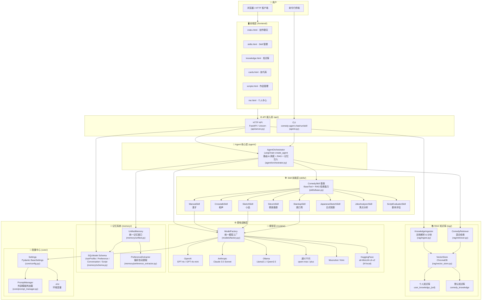
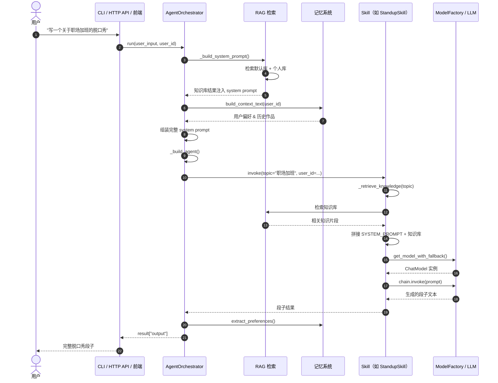
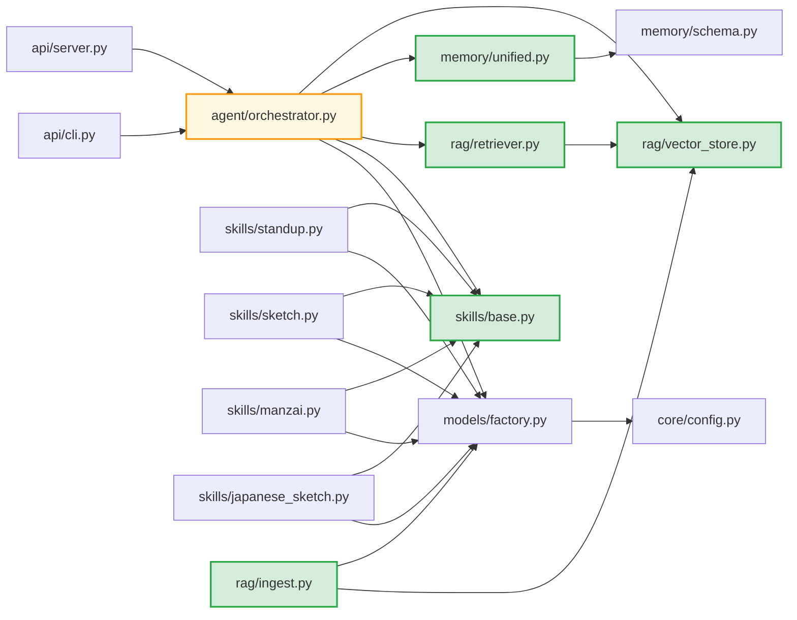

# Comedy Agent 架构图

## 一、系统分层架构



## 二、核心调用链路（含 RAG 注入）



## 三、RAG 知识库数据流

```mermaid
flowchart LR
    subgraph Input["📥 输入"]
        PDF["PDF / Word"]
        Web["网页 / 文本"]
        Sub["SRT / VTT / ASS 字幕"]
    end

    subgraph Ingest["🔧 解析入库 (rag/ingest.py)"]
        Loader["DocumentLoader<br/>多格式解析"]
        Chunker["文本分块<br/>保留时间码元数据"]
        Embed["Embedding<br/>all-MiniLM-L6-v2"]
    end

    subgraph Storage["💾 存储"]
        UserDB[(个人库<br/>user_knowledge_{uid})]
        DefaultDB[(默认库<br/>comedy_knowledge)]
    end

    subgraph Retrieval["🔍 检索 (rag/retriever.py)"]
        VecSearch["向量检索<br/>ChromaDB"]
        BM25["BM25<br/>关键词检索"]
        Merge["合并去重"]
        Rerank["Cross-Encoder<br/>重排序"]
    end

    subgraph Consume["🎯 消费"]
        AgentSys["Agent System Prompt<br/>决策层注入"]
        SkillSys["Skill System Prompt<br/>创作层注入"]
    end

    PDF --> Loader
    Web --> Loader
    Sub --> Loader
    Loader --> Chunker
    Chunker --> Embed
    Embed --> UserDB
    Embed --> DefaultDB
    UserDB --> VecSearch
    DefaultDB --> VecSearch
    VecSearch --> Merge
    BM25 --> Merge
    Merge --> Rerank
    Rerank --> AgentSys
    Rerank --> SkillSys
```

## 四、模块依赖关系



## 五、技术栈

| 层级 | 技术选型 |
|------|----------|
| Agent 框架 | LangChain / LangGraph |
| LLM 接入 | OpenAI, Anthropic, Ollama, 通义千问, Moonshot/Kimi |
| Embedding | HuggingFace `all-MiniLM-L6-v2`（本地，384维）|
| 向量数据库 | ChromaDB（持久化） |
| 记忆存储 | SQLite + SQLModel（开发）/ PostgreSQL（生产） |
| 文档解析 | Unstructured / LangChain DocumentLoader（PDF/Word/网页/字幕） |
| HTTP 框架 | FastAPI + Uvicorn |
| CLI 框架 | argparse |
| 配置管理 | Pydantic Settings + python-dotenv |
| 可观测性 | LangSmith + 自建 Tracer/Metrics |
