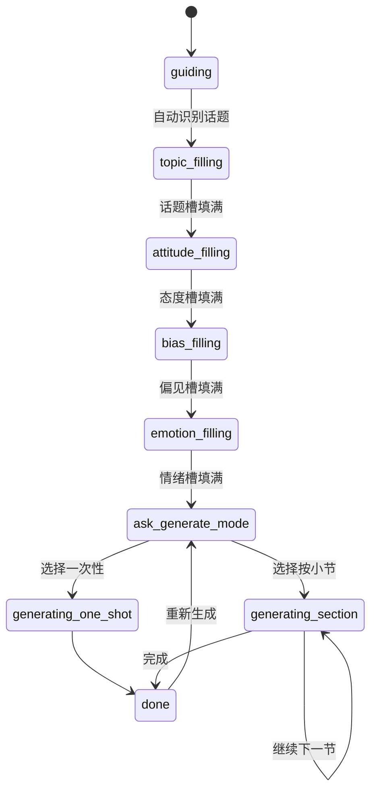

# 专业版 V3 整体计划与完成度

> 文档类型：实施路线图（Roadmap）  
> 适用分支：`v3`  
> 最后更新：2026-06-18  
> 关联文档：
> - `docs/design/v3.md`（V3 设计目标与理念）
> - `docs/output/pro-version-overview.md`（功能/架构/调用流程整理）
> - `data/pro_workflow.json`（状态机配置）
> - `skills/get_daren/skill.py`（中央调度 Skill）
> - `src/comedy_agent/api/routers/pro_workflow.py`（工作流引擎）
> - `frontend/pro.html`（专业版前端）

---

## 一、项目目标

对 Comedy Agent 的「专业版（Pro）」进行 V3 重构，核心目标：

1. **单引擎 + 动态角色提示词**：用一个基座模型实例，通过 System Prompt 切换扮演 8 个创作角色，避免 MoE 多模型路由的成本与复杂度。
2. **聊天区与工作台分离**：聊天区只用于角色发言、cue 人和用户指令；所有正文、调研报告、审稿意见以 Artifact 形式沉淀在右侧工作台。
3. **状态机驱动创作流程**：用状态机管理「话题 → 态度 → 偏见 → 情绪 → 生成 → 完成」的进度，四槽位强制卡点。
4. **灵活生成模式**：支持一次性生成完整剧本，也支持按小节逐段生成。
5. **可扩展的知识与画像注入**：为后续接入外部知识库、画像规则、评估体系留出标准化接口。

---

## 二、阶段划分与当前完成度

### 阶段 0：文档与架构梳理（✅ 已完成）

| 任务 | 完成度 | 说明 | 交付物 |
|------|--------|------|--------|
| 整理专业版功能清单 | 100% | 覆盖页面、后端、创作维度、Skill 能力 | `docs/output/pro-version-overview.md` |
| 整理调用流程 | 100% | 含 Wizard 主路径、直接 Skill 组合路径、数据持久化 | `docs/output/pro-version-overview.md` |
| 输出 V3 设计文档 | 100% | 明确单引擎、交互分离、记忆分层、状态机等设计方向 | `docs/design/v3.md` |

**关键决策（已冻结）**：
- 采用单引擎（deepseek-v4-pro 默认）+ 动态角色提示词，非 MoE。
- Persona 画像在本次重构中先剥离自动注入，仅在用户选择后作为附件参考。
- 业务数据层 `material` Skill 继续用 RSS/网络搜索，外部知识库后续接入。

---

### 阶段 1：角色调度器与响应模型（✅ 已完成）

| 任务 | 完成度 | 说明 | 主要交付 |
|------|--------|------|----------|
| 扩展 `ProChatResponse` | 100% | 新增 `current_role` / `next_role` / `artifacts` / `attachments` / `todo_board` | `src/comedy_agent/api/routers/pro_workflow.py` |
| 扩展 `wf_state` | 100% | 新增 `current_role` / `attachments` / `decision_nodes` / `todo_board` | `src/comedy_agent/api/routers/pro_workflow.py` |
| 重构 `get_daren` | 100% | 引入 `RoleRegistry`，8 个角色，语义意图分类，自动 cue 下一个人 | `skills/get_daren/skill.py` |
| 新增角色元提示词 | 100% | 主持人、话题专家、态度专家、偏见专家、情绪专家、素材调研员、总编、排版专员 | `data/prompts/pro/{role}/default.md` |
| 单元测试 | 100% | 覆盖意图分类、角色切换、槽位填充 | `tests/test_get_daren_v3.py` |

**已实现角色**：
1. 主持人
2. 话题专家
3. 态度专家
4. 偏见专家
5. 情绪专家
6. 素材调研员
7. 总编
8. 排版专员

---

### 阶段 2：Artifacts 工作台与附件传递（✅ 已完成）

| 任务 | 完成度 | 说明 | 主要交付 |
|------|--------|------|----------|
| 右侧 ArtifactsPanel | 100% | `#editor` 升级为 `#artifactsPanel`，按 artifact id 渲染卡片 | `frontend/pro.html` |
| Artifact 操作 | 100% | 支持 `create` / `append` / `update`，禁止 rewrite | `frontend/pro.html` |
| 后端长 artifact 自动转附件 | 100% | 便于下游角色引用 | `skills/get_daren/skill.py` |
| 历史恢复兼容 | 100% | 兼容旧版 `final_script` | `frontend/pro.html`、`src/comedy_agent/api/routers/pro_workflow.py` |
| TODO 看板 | 100% | 基于 `todo_board` 字段渲染 | `frontend/pro.html` |
| 单元测试 | 100% | artifact/attachment 解析与上下文注入 | `tests/test_get_daren_v3.py` |

---

### 阶段 3：状态机增强与生成模式（✅ 已完成）

| 任务 | 完成度 | 说明 | 主要交付 |
|------|--------|------|----------|
| 状态机细化到角色级 | 100% | `guiding` / `topic_filling` / `attitude_filling` / `bias_filling` / `emotion_filling` / `ask_generate_mode` / `generating_one_shot` / `generating_section` / `done` | `data/pro_workflow.json`、`src/comedy_agent/api/routers/pro_workflow.py` |
| 中文槽位 → 英文状态映射 | 100% | 修复 `'̬��_filling'` 编码问题 | `skills/get_daren/skill.py` |
| 四槽位强制卡点 | 100% | 未填满时禁止进入生成阶段，自动引导补全 | `skills/get_daren/skill.py` |
| `ask_generate_mode` 分支 | 100% | 一次性生成 / 按小节生成 | `skills/get_daren/skill.py` |
| 按小节生成模式 | 100% | 自动生成章节大纲，逐节输出，支持继续/修改/完成 | `skills/get_daren/skill.py` |
| 生成完成后处理 | 100% | `done` 状态支持修改/排版/重新生成 | `skills/get_daren/skill.py` |
| 前端交互绑定 | 80% | 快捷按钮可发送继续/修改/完成；状态可视化可继续优化 | `frontend/pro.html` |
| 单元测试 | 100% | 14 个状态机与生成模式用例 | `tests/test_get_daren_v3.py` |

**状态转移图**：

---

### 阶段 4：画像注入、外部知识库与评估优化（⏳ 待规划/待实现）

本阶段包含三条可选主线，可并行或择一推进：

#### 主线 A：画像（Persona）注入（⏳ 未开始）

| 任务 | 完成度 | 说明 |
|------|--------|------|
| 画像选择后作为附件注入 | 0% | 用户选择画像后，将画像规则以 attachment 形式附加到 `wf_state` |
| 画像在角色提示词中生效 | 0% | 在对应角色（如总编生成、情绪专家）的上下文里引用画像规则 |
| 画像影响生成风格 | 0% | 让 LLM 在生成时遵循画像中的语气、禁忌、偏好 |
| 前端画像状态联动 | 0% | 选择/切换画像后，前端实时显示已应用的画像 |

**设计建议**：
- 画像规则统一封装为 `attachment`，`type: "persona"`，在 `_build_context` 中按优先级注入。
- 不自动强制注入，仅在用户显式选择后附加，避免干扰默认流程。

---

#### 主线 B：外部知识库接入（⏳ 未开始）

| 任务 | 完成度 | 说明 |
|------|--------|------|
| 知识库抽象层 | 0% | 定义 `KnowledgeSource` 接口：用户笔记 / 得到 / 学术 / 网络 |
| 用户笔记接入 | 0% | 支持用户上传文档，分块、Embedding、语义检索 |
| 得到/学术源接入 | 0% | 预留 API/爬虫接入点 |
| 搜索优先级策略 | 0% | 用户笔记 > 得到 > 学术 > 网络 |
| `material` Skill 改造 | 0% | 优先查外部知识库，再 fallback 到 RSS/网络 |
| 引用溯源 | 0% | 生成结果标注知识来源 |

**设计建议**：
- 复用现有 ChromaDB 基础设施（`chroma_data/`）。
- 知识库检索结果以 `attachment` 形式进入 `get_daren` 上下文。

---

#### 主线 C：评估与回归体系（⏳ 未开始）

| 任务 | 完成度 | 说明 |
|------|--------|------|
| 定义评估维度 | 0% | 喜剧性、结构完整性、角色一致性、创新性、可读性 |
| `script_evaluator` Skill 集成 | 0% | 生成后自动/手动调用评估 |
| 回归测试集 | 0% | 收集典型输入输出对，防止重构后质量退化 |
| A/B 对比机制 | 0% | 支持对比两个版本的生成结果 |
| 人工反馈闭环 | 0% | 用户对生成结果点赞/点踩，写入偏好记忆 |

---

### 阶段 5：工程化与体验优化（⏳ 未来）

| 任务 | 完成度 | 说明 |
|------|--------|------|
| 状态机可视化 | 0% | 在前端展示当前创作进度，高亮当前状态 |
| 流式输出 | 0% | 剧本生成时流式显示，降低等待感 |
| 会话总结与续写 | 0% | 长会话自动压缩决策节点 |
| 多语言/多平台提示词 | 0% | 小红书/公众号/B站/知乎等平台的角色提示词微调 |
| 性能监控 | 0% | Token 消耗、响应延迟、状态转换埋点 |

---

## 三、当前整体完成度

| 阶段 | 状态 | 完成度 |
|------|------|--------|
| 阶段 0：文档与架构梳理 | ✅ 已完成 | 100% |
| 阶段 1：角色调度器与响应模型 | ✅ 已完成 | 100% |
| 阶段 2：Artifacts 工作台与附件传递 | ✅ 已完成 | 100% |
| 阶段 3：状态机增强与生成模式 | ✅ 已完成 | 100% |
| 阶段 4A：画像注入 | ⏳ 未开始 | 0% |
| 阶段 4B：外部知识库接入 | ⏳ 未开始 | 0% |
| 阶段 4C：评估与回归体系 | ⏳ 未开始 | 0% |
| 阶段 5：工程化与体验优化 | ⏳ 未来 | 0% |

**当前代码健康度**：
- V3 相关单元测试：33 个用例通过（`tests/test_get_daren_v3.py`）
- 相关模块测试：80/80 通过
- 已知问题：`tests/test_preference_extractor.py` 因缺少 `comedy_agent.memory.preference_extractor` 模块无法导入，与 V3 重构无关。

---

## 四、关键设计约束（不变项）

1. **单引擎架构**：一个模型实例 + 动态 System Prompt 切换角色，不引入多模型路由。
2. **Artifact 不可重写**：只支持 `create` / `append` / `update`，禁止 `rewrite`，防止内容丢失。
3. **状态机是核心**：所有创作进度由 `wf_state.current_state` 驱动，四槽位填满才能进入生成阶段。
4. **Attachment 是角色间传递信息的标准方式**：长 artifact、画像规则、知识库结果都应以 attachment 形式注入上下文。
5. **向后兼容**：旧版 `final_script` 在历史恢复时仍能被正确渲染。

---

## 五、下一步建议

阶段 4 有三条主线可选，推荐按以下顺序推进（可根据业务优先级调整）：

1. **画像注入（4A）**：用户价值最直接，实现成本最低，可复用现有 attachment 机制。
2. **评估与回归体系（4C）**：在接入新知识库前建立评估基准，便于衡量后续改动效果。
3. **外部知识库接入（4B）**：工程复杂度最高，建议放在画像和评估之后。

---

## 六、变更记录

| 日期 | 版本 | 说明 |
|------|------|------|
| 2026-06-18 | v1.0 | 首次整理 V3 整体计划与完成度 |
