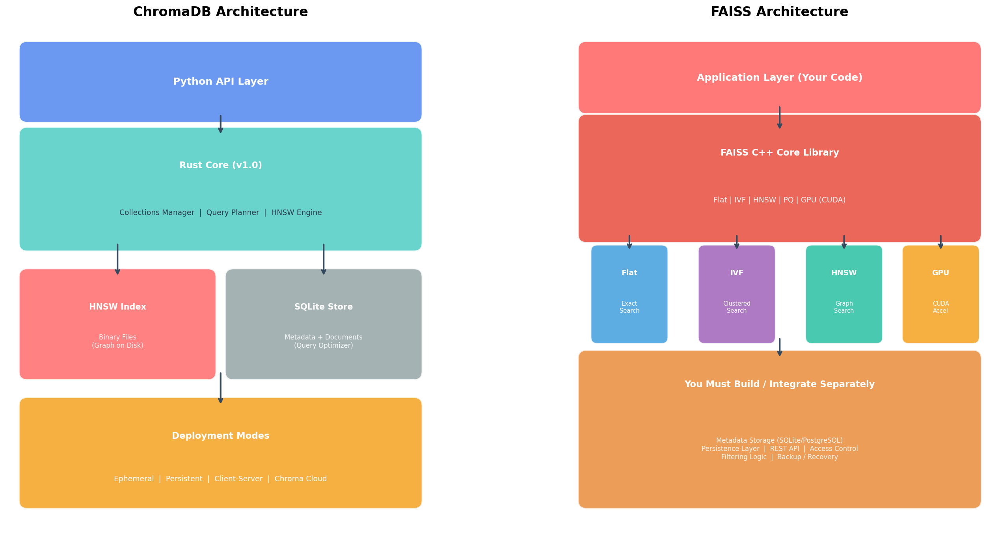
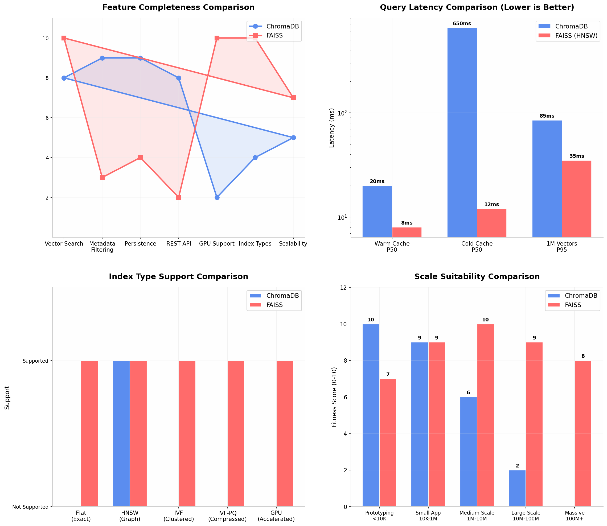

# ChromaDB 与 FAISS 深度对比及迁移分析

## 简要总结

ChromaDB 是一个完整的 **AI 原生嵌入数据库**，内置了 HNSW 向量索引、SQLite 元数据存储、持久化机制和 Python API，定位为"向量数据库界的 SQLite"，核心优势是**开发体验极简**。FAISS（Facebook AI Similarity Search）则是 Meta 开源的**高性能向量相似性搜索算法库**，提供 Flat、IVF、HNSW、PQ 等 **10 余种索引类型** 并支持 GPU 加速，核心优势是**搜索性能极致可控**。两者并非同一抽象层次的产品：ChromaDB 是"开箱即用的数据库"，FAISS 是"需要自己组装的数据库引擎"。对于约 100MB 的喜剧数据集，两者在性能上都能轻松胜任，迁移的关键考量在于新架构是否需要 FAISS 提供的**索引灵活性**或**GPU 加速能力**，以及团队是否愿意承担**自行实现元数据管理和持久化**的工程成本。

---

## 1. 核心定位差异：完整数据库 vs 算法库

理解 ChromaDB 和 FAISS 的首要前提是认清它们的**产品形态差异**——这种差异决定了它们在技术栈中扮演完全不同的角色。

ChromaDB 将自己定义为"AI-native embedding database"，其设计哲学是将向量搜索、元数据管理、持久化存储和嵌入生成整合到一个统一的开发者接口中。 [(123ofAI)](https://123ofai.com/qnalab/system-design/blocks/chromadb)  它封装了 HNSW 索引引擎（2025 年 v1.0 版本后核心改用 Rust 实现）、SQLite 元数据存储、以及支持 10 余家嵌入模型提供商的自动化嵌入管道，开发者只需 `pip install chromadb` 即可在 5 行代码内实现语义搜索。 [(greptile.com)](https://www.greptile.com/grepository/chroma)  这种" batteries-included "的设计理念使其成为 RAG 应用原型开发的事实标准，在 GitHub 上获得超过 27,000 颗星，被 90,000 多个开源项目使用。 [(123ofAI)](https://123ofai.com/qnalab/system-design/blocks/chromadb) 

FAISS 则是一个截然不同的存在。它是由 Meta AI Research 开发的 C++ 库，通过 Python 绑定暴露给上层应用，其设计目标是在给定硬件约束下实现**最快的向量相似性搜索**。 [(Milvus)](https://milvus.io/ai-quick-reference/what-optimizations-do-libraries-like-faiss-implement-to-maintain-high-throughput-for-vector-search-on-cpus-and-how-do-these-differ-when-utilizing-gpu-acceleration)  FAISS 不提供数据库存储语义——没有内置的持久化机制、没有元数据查询能力、没有 REST API、没有访问控制。它专注于一件事：给定一组查询向量和一个索引好的向量集合，以最快的速度返回最相似的 K 个结果。 [(upGrad)](https://www.upgrad.com/blog/is-faiss-vector-database/)  这种极度聚焦的设计使 FAISS 能够在多种索引策略、量化方法和硬件加速方案之间提供工程级的精细控制。

| 维度 | ChromaDB | FAISS |
|------|----------|-------|
| **产品类型** | 开源 AI 嵌入数据库  [(mljourney.com)](https://mljourney.com/faiss-vector-database-vs-chromadb-comparison-for-modern-ai-applications/)  | 向量相似性搜索算法库  [(Designveloper)](https://www.designveloper.com/blog/chroma-vs-faiss-vs-pinecone/)  |
| **开发公司** | Chroma AI | Meta AI Research (FAIR)  [(CSDN博客)](https://blog.csdn.net/BreakingWindAntony/article/details/160690254)  |
| **核心语言** | Rust (v1.0 核心) + Python API  [(trychroma.com)](https://www.trychroma.com/project/1.0.0)  | C++ (核心) + Python 绑定  [(Milvus)](https://milvus.io/ai-quick-reference/what-optimizations-do-libraries-like-faiss-implement-to-maintain-high-throughput-for-vector-search-on-cpus-and-how-do-these-differ-when-utilizing-gpu-acceleration)  |
| **设计哲学** | 开发者体验优先，开箱即用  [(123ofAI)](https://123ofai.com/qnalab/system-design/blocks/chromadb)  | 性能与控制优先，灵活组装  [(MyEngineerPath)](https://myengineeringpath.dev/tools/chroma-vs-faiss/)  |
| **完整数据库功能** | 是（持久化、CRUD、元数据过滤） [(techtidesolutions.com)](https://techtidesolutions.com/blog/what-is-chromadb/)  | 否（仅向量搜索） [(upGrad)](https://www.upgrad.com/blog/is-faiss-vector-database/)  |
| **REST API** | 支持（Client-Server 模式） [(Mintlify)](https://www.mintlify.com/chroma-core/chroma/deployment/overview)  | 不支持（纯库调用） [(zackproser.com)](https://zackproser.com/blog/faiss-vs-chroma)  |
| **嵌入生成** | 内置 10+ 提供商支持  [(123ofAI)](https://123ofai.com/qnalab/system-design/blocks/chromadb)  | 需自行生成  [(CSDN博客)](https://blog.csdn.net/BreakingWindAntony/article/details/160690254)  |
| **部署模式** | 内存 / 持久化 / 客户端-服务器 / 云  [(Mintlify)](https://www.mintlify.com/chroma-core/chroma/deployment/overview)  | 应用内嵌（无独立部署概念） [(The Neural Base)](https://theneuralbase.com/rag/qna/faiss-vs-chroma-comparison/)  |

这种定位差异直接影响了团队的技术决策：选择 ChromaDB 意味着接受一个**有边界的完整产品**，在边界内获得最高开发效率；选择 FAISS 意味着获得一个**高性能的构建块**，需要自行搭建周边基础设施。

---

## 2. 架构与技术特性深度对比

### 2.1 索引引擎：单一策略 vs 全谱系覆盖

ChromaDB 在索引策略上采取了**单一但优化**的路线。它内部使用 HNSW（Hierarchical Navigable Small World）图索引算法，v1.0 版本后将 HNSW 引擎从 Python 迁移到 Rust，消除了 Python GIL（全局解释器锁）瓶颈，实现了真正的多线程查询处理，读写性能提升 **3-5 倍**。 [(trychroma.com)](https://www.trychroma.com/project/1.0.0)  然而，ChromaDB 不支持其他索引类型——没有 IVF（倒排文件索引）、没有 PQ（乘积量化）、没有 Flat 精确搜索，也不支持 GPU 加速。 [(blog.amsayed.dev)](https://blog.amsayed.dev/blog/vector-db-part-8)  这种设计简化了使用体验（开发者无需理解索引选择），但也意味着在面对特定工作负载时缺乏调优空间。

FAISS 则提供了**完整的索引策略谱系**，覆盖从精确搜索到高度压缩的近似搜索的各种需求： [(abstractalgorithms.dev)](https://abstractalgorithms.dev/ann-index-types-when-to-choose-hnsw-ivf-pq-flat) 

- **IndexFlat (FlatL2 / FlatIP)**：精确最近邻搜索，对所有向量进行全量距离计算，召回率 **100%**，适合作为质量基准和小型数据集（<10 万向量）的搜索方案  [(abstractalgorithms.dev)](https://abstractalgorithms.dev/ann-index-types-when-to-choose-hnsw-ivf-pq-flat) 
- **IndexIVF (IVFFlat)**：基于 k-means 聚类的倒排文件索引，将向量空间划分为若干聚类单元，查询时仅搜索最相关的 nprobe 个单元，在 10 万-1000 万向量规模下实现显著加速  [(Milvus)](https://milvus.io/ai-quick-reference/how-does-indexing-work-in-a-vector-db-ivf-hnsw-pq-etc) 
- **IndexHNSW**：图索引算法，与 ChromaDB 底层使用的索引类型相同，但在 FAISS 中可通过参数精细调优 M、efConstruction、efSearch 等关键指标  [(Vectroid)](https://vectroid.com/resources/hnsw-vs-faiss-comprehensive-comparison) 
- **IndexIVFPQ**：将 IVF 与乘积量化结合，通过将高维向量压缩为紧凑编码实现 **10-50 倍的内存节省**，适用于内存受限的大规模场景  [(hooos.com)](https://www.hooos.com/data-9970) 
- **GPU 加速索引**：通过 CUDA 内核实现批量查询的并行距离计算，在 A100 GPU 上可达到超过 **1.5 TB/s 的内存带宽**，批量查询速度比 CPU 快 **10-100 倍**  [(Milvus)](https://milvus.io/ai-quick-reference/what-optimizations-do-libraries-like-faiss-implement-to-maintain-high-throughput-for-vector-search-on-cpus-and-how-do-these-differ-when-utilizing-gpu-acceleration) 



上图清晰展示了两者的架构差异：ChromaDB 是一个垂直整合的封闭系统，各层之间通过内部接口连接；FAISS 则是一个水平扩展的开放系统，索引类型可根据需求灵活替换，但大量数据库层功能需要应用层自行实现。

### 2.2 元数据管理：内置过滤 vs 外部维护

ChromaDB 将元数据管理作为核心能力之一。它使用 **SQLite** 作为元数据和文档内容的存储后端，支持通过 `where` 子句进行复杂的元数据过滤查询——包括等于、不等于、包含、范围查询、逻辑组合（AND/OR）等操作。 [(arXiv.org)](https://arxiv.org/html/2604.21284v1)  这种设计使开发者可以在单一 API 调用中同时表达"搜索与查询最相似的向量"和"仅返回满足特定元数据条件的文档"两种语义。例如，在喜剧写作场景中，可以直接查询 `{"genre": "standup", "era": "2020s"}` 过滤条件下的相似段子。

FAISS 本身**不提供元数据管理功能**。作为一个纯向量搜索库，FAISS 的索引只存储向量本身和一个可选的整数 ID（通过 `IndexIDMap` 包装器）。 [(databricks.com)](https://community.databricks.com/t5/machine-learning/how-to-store-amp-update-a-faiss-index-in-databricks/td-p/138918)  如果需要元数据过滤，必须采用**混合架构**：将元数据存储在独立的关系型数据库（如 SQLite 或 PostgreSQL）中，通过 ID 将 FAISS 的搜索结果与元数据表关联。 [(arXiv.org)](https://arxiv.org/html/2601.20352v1)  学术研究中的常见模式是 **FAISS + SQLite** 组合——FAISS 负责向量相似性搜索，SQLite 负责结构化元数据存储和过滤，两者通过向量 ID 桥接。 [(arXiv.org)](https://arxiv.org/html/2606.11257v1)  这种模式在功能上等价于 ChromaDB 的内建实现，但需要开发者自行处理两阶段查询的协调逻辑。

### 2.3 持久化与部署

ChromaDB 提供**四种部署模式**，覆盖从原型开发到生产环境的全生命周期： [(Mintlify)](https://www.mintlify.com/chroma-core/chroma/deployment/overview) 

- **EphemeralClient**：纯内存模式，数据随进程结束而丢失，适用于测试和快速实验
- **PersistentClient**：本地磁盘持久化，数据存储在 SQLite 和二进制索引文件中，适用于本地开发和小型应用
- **HttpClient**：连接远程 Chroma 服务器，支持多客户端并发访问，是推荐的生产部署方式
- **Chroma Cloud**：托管云服务，提供无服务器扩展和按量计费

FAISS 没有内置的持久化机制。索引数据常驻内存以获得最佳搜索性能，但可以通过 `faiss.write_index()` 和 `faiss.read_index()` 将索引序列化到磁盘。 [(Github)](https://github.com/zechenzhangAGI/AI-research-SKILLs/blob/main/15-rag/faiss/SKILL.md)  这种方式简单高效，但仅保存索引结构本身——不保存元数据、不保存文档内容、不提供增量更新机制。对于生产环境，通常需要构建自定义的持久化层：将 FAISS 索引文件、元数据 JSON/数据库、文档存储分别管理，并在应用启动时加载到内存。 [(databricks.com)](https://community.databricks.com/t5/machine-learning/how-to-store-amp-update-a-faiss-index-in-databricks/td-p/138918) 

---

## 3. 性能对比：延迟、吞吐量与召回率

### 3.1 查询延迟

在向量搜索的**原始性能**方面，FAISS 通常优于 ChromaDB，但差距的具体大小高度依赖于索引类型、数据规模和查询模式。



在 **100K 向量、384 维度**的数据集上，ChromaDB 的 P50 延迟约为 **20ms**（热缓存状态），而冷缓存状态下由于需要从磁盘加载 HNSW 图结构，延迟可能飙升至 **650ms**——这是一个 **32.5 倍**的性能差异，反映了 ChromaDB 缓存敏感的设计特点。 [(Strapi)](https://strapi.io/blog/best-vector-databases-ai-applications)  相比之下，FAISS 的 HNSW 实现（IndexHNSWFlat）在相似规模下的单查询延迟约为 **8ms**，且不受缓存状态显著影响，因为索引始终驻留在内存中。 [(MyEngineerPath)](https://myengineeringpath.dev/tools/chroma-vs-faiss/) 

在 **100 万向量**规模下，ChromaDB 的 P95 延迟约为 **85ms**，而 FAISS HNSW 约为 **35ms**。 [(MyEngineerPath)](https://myengineeringpath.dev/tools/chroma-vs-faiss/)  当使用 FAISS GPU 索引时，批量查询（batch query）的性能优势更加显著：在 A100 GPU 上，FAISS 可以处理约 **50,000 QPS**，而 ChromaDB 在相同规模下约为 **200 QPS**。 [(MyEngineerPath)](https://myengineeringpath.dev/tools/chroma-vs-faiss/)  不过需要指出的是，这种 GPU 批量查询的优势主要在 ML 实验和离线批处理场景中体现，对于在线服务的单查询场景，差距会缩小。

### 3.2 召回率与检索质量

在检索质量方面，多项独立研究表明 **FAISS 在召回率上优于 ChromaDB**。在一项针对 RAG 系统的对比研究中，FAISS 的上下文精确度（Context Precision）平均为 **0.821**，而 ChromaDB 为 **0.776**；上下文召回率（Context Recall）FAISS 为 **0.821**，ChromaDB 为 **0.776**——FAISS 在两项关键指标上均领先约 **6%**。 [(arXiv.org)](https://arxiv.org/pdf/2505.08445)  另一项研究在法律文档检索场景中也发现，FAISS 在召回率上"consistently outperforms Chroma"，这对于确保法律条文的完整检索至关重要。 [(arXiv.org)](https://arxiv.org/pdf/2502.16573) 

这种质量差异的可能原因在于：FAISS 的 HNSW 实现允许更精细的参数调优（如 `efConstruction`、`efSearch`、`M`），而 ChromaDB 为了简化使用对这些参数进行了封装和固定；此外，FAISS 支持精确搜索（Flat）作为基准验证，帮助开发者检测索引漂移，而 ChromaDB 缺乏这种能力。 [(abstractalgorithms.dev)](https://abstractalgorithms.dev/ann-index-types-when-to-choose-hnsw-ivf-pq-flat) 

### 3.3 写入与索引构建性能

ChromaDB v1.0 的 Rust 重写显著提升了写入性能，**批量写入速度提升 3-5 倍**，100 万向量的初始导入时间从数十分钟缩短到数分钟级别。 [(trychroma.com)](https://www.trychroma.com/project/1.0.0)  然而，ChromaDB 的写入吞吐量仍受限于 SQLite 的串行写入特性和 HNSW 图构建的计算开销。

FAISS 在索引构建方面提供了更多优化空间。HNSW 索引的构建速度可通过调整 `M` 和 `efConstruction` 参数进行权衡——较高的参数值产生更高质量的图但构建更慢。对于大规模数据集，FAISS 的 IVF 索引需要先进行 k-means 聚类训练，这一过程可以充分利用多核 CPU 并行化。最值得注意的是，FAISS 支持 **GPU 加速索引构建**：通过 NVIDIA cuVS 集成，CAGRA 图索引的构建速度比 CPU HNSW 快 **12 倍**。 [(NVIDIA Developer)](https://developer.nvidia.com/blog/enhancing-gpu-accelerated-vector-search-in-faiss-with-nvidia-cuvs/) 

---

## 4. 各自的优势场景与适用边界

### 4.1 ChromaDB 的核心优势

ChromaDB 的最大优势在于**开发效率和上手速度**。从安装到运行第一个语义搜索查询，ChromaDB 可以在 **30 秒**内完成，而 FAISS 即使是最简单的用例也需要更多配置代码。 [(123ofAI)](https://123ofai.com/qnalab/system-design/blocks/chromadb)  这种低门槛使其成为以下场景的理想选择：

**快速原型开发与 MVP 构建**：当团队需要验证一个 RAG 概念、测试不同的分块策略或比较嵌入模型效果时，ChromaDB 允许开发者专注于业务逻辑而非基础设施。LangChain 和 LlamaIndex 等主流框架将 Chroma 作为默认向量存储，提供了最丰富的集成文档和社区示例。 [(adyog.com)](https://blog.adyog.com/2025/12/03/chroma-vector-database-the-open-source-foundation-for-ai-search/) 

**中小规模应用（<100 万向量）**：在 100MB 量级的喜剧数据集（估计向量数在数万到数十万之间）场景下，ChromaDB 的性能完全充足，其简洁的 API 和内置持久化可以显著减少工程维护成本。 [(blog.amsayed.dev)](https://blog.amsayed.dev/blog/vector-db-part-8) 

**需要元数据过滤的应用**：如果查询场景频繁需要结合向量相似性和结构化过滤（如"找与这个段子风格相似且创作于 2023 年后的内容"），ChromaDB 的内置 `where` 过滤能力可以避免自行实现两阶段查询的复杂性。 [(arXiv.org)](https://arxiv.org/html/2604.21284v1) 

**本地开发与边缘部署**：ChromaDB 的 PersistentClient 将整个数据库存储在一个本地目录中，可以轻松复制、备份或版本控制，非常适合需要在离线环境或边缘设备上运行的应用。 [(123ofAI)](https://123ofai.com/qnalab/system-design/blocks/chromadb) 

### 4.2 FAISS 的核心优势

FAISS 的核心优势在于**性能控制力和扩展灵活性**，特别适合以下场景：

**大规模数据检索（>1000 万向量）**：当向量数量超过千万级别时，ChromaDB 的单节点架构会遇到内存和 QPS 瓶颈（1000 万向量时 QPS 降至约 **112**）， [(123ofAI)](https://123ofai.com/qnalab/system-design/blocks/chromadb)  而 FAISS 通过 IVF 分区、PQ 压缩和多 GPU 分片可以扩展到**数十亿向量**。 [(Milvus)](https://milvus.io/ai-quick-reference/what-optimizations-do-libraries-like-faiss-implement-to-maintain-high-throughput-for-vector-search-on-cpus-and-how-do-these-differ-when-utilizing-gpu-acceleration) 

**需要 GPU 加速的场景**：对于批量嵌入计算、大规模离线检索或高并发在线服务，FAISS 的 CUDA 支持可以提供 **10-100 倍**的吞吐量提升。 [(Github)](https://github.com/zechenzhangAGI/AI-research-SKILLs/blob/main/15-rag/faiss/SKILL.md)  这在需要实时响应的推荐系统和视觉搜索平台中尤为重要。

**索引策略定制需求**：当业务场景对延迟、召回率、内存占用有特定要求时，FAISS 允许在 Flat（精确）、HNSW（平衡）、IVF-PQ（压缩）等多种索引之间灵活选择，甚至可以构建复合索引（如 IVF+HNSW+PQ）。 [(towardsdatascience.com)](https://towardsdatascience.com/ivfpq-hnsw-for-billion-scale-similarity-search-89ff2f89d90e/) 

**自定义搜索管线**：对于需要在向量搜索前后插入自定义逻辑（如重排序、多阶段检索、混合稀疏-密集搜索）的高级应用，FAISS 的低层 API 提供了最大的灵活性。

| 场景特征 | 推荐选择 | 核心理由 |
|----------|----------|----------|
| 快速原型 / MVP 开发 | **ChromaDB** | 5 分钟上手，零配置  [(123ofAI)](https://123ofai.com/qnalab/system-design/blocks/chromadb)  |
| < 100 万向量的生产应用 | **ChromaDB** | 功能完整，运维简单  [(blog.amsayed.dev)](https://blog.amsayed.dev/blog/vector-db-part-8)  |
| 需要复杂元数据过滤 | **ChromaDB** | 内置 `where` 过滤  [(arXiv.org)](https://arxiv.org/html/2604.21284v1)  |
| > 1000 万向量的搜索 | **FAISS** | IVF/PQ 支持大规模扩展  [(hooos.com)](https://www.hooos.com/data-9970)  |
| 需要 GPU 批量加速 | **FAISS** | CUDA 内核 10-100x 加速  [(Milvus)](https://milvus.io/ai-quick-reference/what-optimizations-do-libraries-like-faiss-implement-to-maintain-high-throughput-for-vector-search-on-cpus-and-how-do-these-differ-when-utilizing-gpu-acceleration)  |
| 索引策略精细调优 | **FAISS** | 10+ 索引类型可选  [(abstractalgorithms.dev)](https://abstractalgorithms.dev/ann-index-types-when-to-choose-hnsw-ivf-pq-flat)  |
| 混合搜索管线定制 | **FAISS** | 低层 API 灵活组装  [(MyEngineerPath)](https://myengineeringpath.dev/tools/chroma-vs-faiss/)  |
| 学术研究 / 基准测试 | **FAISS** | Flat 精确搜索作为真值基准  [(abstractalgorithms.dev)](https://abstractalgorithms.dev/ann-index-types-when-to-choose-hnsw-ivf-pq-flat)  |

---

## 5. 针对喜剧数据迁移的具体分析

### 5.1 数据规模评估

您的喜剧数据约 **100MB**，这是一个关键参考点。假设使用常见的文本嵌入模型（如 OpenAI text-embedding-3-small 的 1536 维或 all-MiniLM-L6-v2 的 384 维），100MB 的原始文本经过分块和嵌入后，向量索引的内存占用约为 **200MB-1GB**（取决于维度和是否存储原始文本）。这个规模：

- **远低于 ChromaDB 的 1000 万向量实践上限**（约 5-10M 向量后开始显著降级） [(123ofAI)](https://123ofai.com/qnalab/system-design/blocks/chromadb) 
- **远低于 FAISS 的任何索引类型的压力点**
- 在两种系统的"舒适区"内，性能差异主要体现在**微秒到毫秒级别**

从纯性能角度，**100MB 数据不需要 FAISS 提供的大规模扩展能力**。迁移的驱动力应来自架构层面——如新方案需要特定的索引类型、GPU 支持，或与现有技术栈的整合需求。

### 5.2 迁移的核心收益与成本

**迁移至 FAISS 的潜在收益**：

- **索引灵活性**：如果新架构需要尝试多种索引策略（如先用 Flat 精确搜索评估质量，再切换到 HNSW 优化速度），FAISS 提供了这种实验自由度
- **未来扩展性**：即使当前数据量小，如果喜剧库预计快速增长（如接入更多数据源、用户生成内容），FAISS 的 IVF-PQ 等压缩索引可提供扩展路径
- **GPU 加速空间**：如果后续需要批量处理（如为整个喜剧库生成相似度矩阵用于聚类分析），FAISS GPU 索引可提供显著加速
- **与学术生态的兼容性**：大量研究论文和开源项目以 FAISS 为基准，使用 FAISS 便于复现和对比先进算法

**迁移的工程成本**：

- **元数据管理重构**：需要将 ChromaDB 中内置的元数据过滤逻辑迁移到独立的 SQLite/PostgreSQL 数据库，并自行实现两阶段查询（先向量搜索、再元数据过滤） [(arXiv.org)](https://arxiv.org/html/2601.20352v1) 
- **持久化方案设计**：需要构建自定义的索引保存/加载机制，包括版本管理和增量更新策略
- **API 层封装**：如果原有代码依赖 ChromaDB 的高级 API（如 `collection.query()` 的 `where_document` 过滤），需要在 FAISS 之上封装等效接口
- **嵌入管道分离**：ChromaDB 可以自动处理文本到嵌入的转换，而 FAISS 只接受预计算的向量，需要确保嵌入模型的调用逻辑已独立存在

### 5.3 推荐迁移架构：FAISS + SQLite 混合模式

针对喜剧写作系统的迁移，最务实且广泛验证的架构是 **FAISS + SQLite 分离存储** 模式——这也是学术研究和生产系统中最常见的 FAISS 使用方式： [(arXiv.org)](https://arxiv.org/html/2606.11257v1) 

```
┌─────────────────────────────────────────────────────────────┐
│                    Application Layer                         │
│  ┌──────────────┐  ┌──────────────┐  ┌──────────────┐      │
│  │   Text Query │→│  Embedding   │→│  Retrieval   │      │
│  │              │  │    Model     │  │   Engine     │      │
│  └──────────────┘  └──────────────┘  └──────┬───────┘      │
└───────────────────────────────────────────────┼─────────────┘
                                                │
                    ┌───────────────────────────┴───────────┐
                    │                                       │
        ┌───────────▼────────────┐            ┌────────────▼────────┐
        │    FAISS Index         │            │    SQLite DB        │
        │  (Vector Embeddings)   │            │  (Metadata + Docs)  │
        │                        │            │                     │
        │  IndexHNSWFlat / IVF   │            │  id | text | genre  │
        │                        │            │      | era | tags   │
        └───────────┬────────────┘            └──────────┬──────────┘
                    │                                    │
                    │         ID-based Join              │
                    └────────────────────────────────────┘
```

这种架构的核心工作流是：

1. **索引阶段**：喜剧文本经过分块后，由嵌入模型生成向量，存入 FAISS 索引；同时文本内容、元数据（类型、年代、标签等）存入 SQLite 数据库，两者通过整数 ID 关联
2. **查询阶段**：用户查询先经嵌入模型转为向量，在 FAISS 中执行 ANN 搜索获得候选 ID 列表；再用这些 ID 查询 SQLite 进行元数据过滤和文本内容获取
3. **持久化阶段**：FAISS 索引通过 `write_index` 定期保存到磁盘，SQLite 数据库天然支持 ACID 持久化

---

## 6. 迁移实施路径

### 6.1 数据导出与转换

从 ChromaDB 导出数据是迁移的第一步。ChromaDB 的 Python API 提供了完整的集合遍历能力：

```python
import chromadb

client = chromadb.PersistentClient(path="./chroma_db")
collection = client.get_collection("comedy_data")

# 导出所有数据
results = collection.get(include=["embeddings", "metadatas", "documents"])
ids = results["ids"]
embeddings = results["embeddings"]  # numpy array
metadatas = results["metadatas"]
documents = results["documents"]
```

导出的数据需要转换为 FAISS 的输入格式。FAISS 要求向量是 **float32 类型的 NumPy 数组**，ID 为 **int64 类型**（或通过 `IndexIDMap` 包装器支持任意 ID）。

### 6.2 索引构建与选择

对于 100MB 规模的喜剧数据，推荐从 **IndexHNSWFlat** 开始——这与 ChromaDB 内部使用的索引类型相同，可以在保持相似召回率的同时获得更快的查询速度：

```python
import faiss
import numpy as np

# 假设 embeddings 是 (N, D) 的 float32 数组
dimension = len(embeddings[0])

# 构建 HNSW 索引
index = faiss.IndexHNSWFlat(dimension, M=32)
index.hnsw.efConstruction = 200
index.hnsw.efSearch = 128

# 添加向量（带 ID 映射）
index = faiss.IndexIDMap(index)
ids_np = np.array([int(i) for i in ids], dtype=np.int64)
embeddings_np = np.array(embeddings, dtype=np.float32)
index.add_with_ids(embeddings_np, ids_np)

# 保存索引
faiss.write_index(index, "comedy_faiss.index")
```

如果后续数据增长到千万级别，可以无缝切换到 `IndexIVFPQ` 以节省内存：

```python
# 千万级数据时的压缩索引
nlist = 4096  # 聚类中心数
m = 16        # PQ 子空间数
nbits = 8     # 每个子空间编码位数

quantizer = faiss.IndexHNSWFlat(dimension, 32)
index = faiss.IndexIVFPQ(quantizer, dimension, nlist, m, nbits)
index.train(embeddings_np)  # 需要先训练
index.add_with_ids(embeddings_np, ids_np)
```

### 6.3 元数据存储实现

SQLite 是 FAISS 最常见的元数据搭档，其零配置特性和事务支持非常适合这种场景： [(arXiv.org)](https://arxiv.org/html/2601.20352v1) 

```python
import sqlite3

conn = sqlite3.connect("comedy_metadata.db")
conn.execute("""
    CREATE TABLE IF NOT EXISTS comedy_chunks (
        id INTEGER PRIMARY KEY,
        text TEXT NOT NULL,
        genre TEXT,
        era TEXT,
        comedian TEXT,
        source TEXT,
        tags TEXT,
        created_at TIMESTAMP DEFAULT CURRENT_TIMESTAMP
    )
""")

# 批量导入元数据
for i, (doc, meta) in enumerate(zip(documents, metadatas)):
    conn.execute(
        "INSERT INTO comedy_chunks (id, text, genre, era, comedian, source, tags) VALUES (?, ?, ?, ?, ?, ?, ?)",
        (int(ids[i]), doc, meta.get("genre"), meta.get("era"), 
         meta.get("comedian"), meta.get("source"), meta.get("tags"))
    )
conn.commit()
```

### 6.4 查询接口封装

为了在新架构中保持与 ChromaDB 相似的查询体验，建议封装一个统一的检索接口：

```python
class ComedyRetriever:
    def __init__(self, faiss_path, sqlite_path, embedding_model):
        self.index = faiss.read_index(faiss_path)
        self.conn = sqlite3.connect(sqlite_path)
        self.embedder = embedding_model
    
    def search(self, query, k=10, filters=None):
        # 1. 向量化查询
        query_vec = self.embedder.encode([query]).astype(np.float32)
        
        # 2. FAISS 向量搜索（扩大搜索范围以容纳过滤）
        search_k = k * 4 if filters else k
        distances, ids = self.index.search(query_vec, search_k)
        
        # 3. 元数据过滤
        if filters:
            ids, distances = self._apply_metadata_filter(ids[0], distances[0], filters, k)
        
        # 4. 获取文本内容
        results = self._fetch_documents(ids)
        return results
    
    def _apply_metadata_filter(self, ids, distances, filters, k):
        # 构建 SQL WHERE 条件
        conditions = []
        params = []
        for key, value in filters.items():
            conditions.append(f"{key} = ?")
            params.append(value)
        
        placeholders = ','.join('?' * len(ids))
        sql = f"""
            SELECT id FROM comedy_chunks 
            WHERE id IN ({placeholders}) AND {' AND '.join(conditions)}
            LIMIT ?
        """
        
        cursor = self.conn.execute(sql, [int(i) for i in ids] + params + [k])
        filtered_ids = [row[0] for row in cursor.fetchall()]
        
        # 保留原始距离顺序
        id_to_dist = {int(i): d for i, d in zip(ids, distances)}
        filtered_distances = [id_to_dist[i] for i in filtered_ids]
        
        return filtered_ids, filtered_distances
```

---

## 7. 风险与注意事项

### 7.1 功能缺失风险

迁移到 FAISS 意味着放弃 ChromaDB 提供的一系列开箱即用功能，需要在应用层自行实现或寻找替代方案：

- **删除操作**：FAISS 的 `IndexHNSWFlat` **不支持删除向量**（`remove_ids` 会抛出 RuntimeError），只能通过标记删除（soft delete）或在 SQLite 中设置删除标志来模拟。 [(arXiv.org)](https://arxiv.org/html/2606.18497v1)  如果需要物理删除，必须重建索引。
- **增量更新**：FAISS 支持向现有索引添加新向量（`add_with_ids`），但不支持修改已有向量。如果需要更新，通常需要删除后重新添加。
- **备份与恢复**：ChromaDB 的数据库文件可以直接复制备份；FAISS 的索引文件也可以复制，但需要确保与元数据数据库的版本一致性。

### 7.2 性能陷阱

- **冷启动延迟**：FAISS 索引需要加载到内存后才能查询，大型索引的加载时间可能较长。对于 100MB 数据这不是问题，但如果未来扩展到 GB 级别，需要考虑懒加载或索引分片。
- **IVF 索引的训练需求**：如果选择 IVF 或 IVFPQ 索引，必须在添加向量之前使用代表性数据训练聚类中心。训练数据分布与实际数据分布不一致会导致召回率显著下降。 [(databricks.com)](https://community.databricks.com/t5/machine-learning/how-to-store-amp-update-a-faiss-index-in-databricks/td-p/138918) 
- **HNSW 的内存占用**：HNSW 索引的内存开销约为原始向量的 **1.5-2 倍**（需要存储图结构），在资源受限的环境中需要留意。

### 7.3 运维复杂度

| 运维维度 | ChromaDB | FAISS + SQLite |
|----------|----------|----------------|
| 监控指标 | 内置基本统计 | 需自行实现 |
| 日志记录 | 支持 | 需自行实现 |
| 访问控制 | Client-Server 模式支持认证  [(zackproser.com)](https://zackproser.com/blog/faiss-vs-chroma)  | 需应用层实现 |
| 数据备份 | 文件级复制 | FAISS 文件 + SQLite 文件同步备份 |
| 版本升级 | 官方迁移指南  [(trychroma.com)](https://www.trychroma.com/project/1.0.0)  | 关注 FAISS 版本兼容性 |
| 故障恢复 | 自动恢复机制 | 需自行设计恢复流程 |

---

## 8. 决策建议

综合以上分析，针对您的喜剧写作系统和约 100MB 数据规模的迁移决策，建议遵循以下逻辑：

**如果新架构设计文档选择 FAISS 是出于以下原因，迁移是合理且值得的**：

- 需要多种索引策略的灵活性（如未来可能尝试 IVF-PQ 压缩）
- 后续有计划扩展到更大规模数据（>1000 万向量）
- 需要 GPU 加速进行批量分析或离线处理
- 团队有能力且愿意维护 FAISS + SQLite 的混合架构

**如果迁移 FAISS 仅是因为"架构变化"而没有明确的性能或功能需求，建议审慎评估**：

- 100MB 数据在 ChromaDB 上运行良好，迁移本身不会带来显著性能提升
- ChromaDB 的开发效率优势（内置元数据过滤、自动持久化、简洁 API）在中小规模场景下价值显著
- 可以考虑保留 ChromaDB 作为开发/测试环境，仅在生产环境使用 FAISS，或反之

**折中方案**：如果架构需要 FAISS 但又不想完全放弃 ChromaDB 的便利性，可以考虑使用 **LangChain 的向量存储抽象层**——LangChain 同时提供了 `Chroma` 和 `FAISS` 的封装类，API 接口高度一致，可以在两者之间低成本的切换： [(CSDN博客)](https://blog.csdn.net/mango/article/details/155470016) 

```python
from langchain_community.vectorstores import Chroma, FAISS

# 两种存储的接口几乎一致
# vectorstore = Chroma.from_documents(docs, embeddings)
# vectorstore = FAISS.from_documents(docs, embeddings)

# 查询接口完全相同
results = vectorstore.similarity_search(query, k=5, filter={"genre": "standup"})
```

这种方案的最大优势是业务代码无需关心底层存储的具体实现，未来如果需要再次切换（如从 FAISS 迁到 Qdrant 或 Milvus），改动成本极低。
