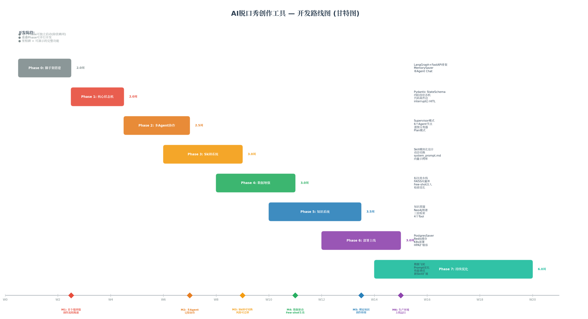

# AI脱口秀创作工具 — 整体设计与开发计划（Master Plan）

## TL;DR

重构计划分为**8个Phase、约20周、6个里程碑**，遵循"**脚手架先行→核心状态机→多Agent协作→Skill系统→数据增强→知识系统→部署上线→持续优化**"的递进路线。关键设计决策：**确定性代码控制状态流转**（非模型语义判断）、**Supervisor多Agent星型拓扑**（6个专职Agent）、**Skill=Prompt+向量示例+工具**（运行时动态切换）、**RAG+Few-shot数据增强**（非Fine-tuning）、**知识图谱+向量双重存储**（三层混合检索）、**K8s+PostgresSaver集群部署**（水平扩展）。总开发周期约5个月，MVP（Phase 0-2）可在6周内产出可演示版本。



---

## 1. 整体设计原则

### 1.1 架构设计五原则

| 原则 | 说明 | 反例（当前架构的问题） |
|---|---|---|
| **代码控制流程** | 状态流转由代码条件边决定，模型只负责内容生成 | 让模型语义判断"该走哪条边"，经常出错 |
| **单Supervisor协调** | 一个总编Agent负责任务分配，Worker各司其职 | 多Agent直接互相调用，调试困难 |
| **状态Schema强类型** | Pydantic BaseModel定义状态，运行时校验 | TypedDict无运行时校验，错误状态继续流转 |
| **Human-in-the-Loop** | 每段写作后interrupt()暂停，等人类反馈 | 全自动生成，用户无法逐段修改 |
| **按需检索而非预加载** | 知识和数据在需要时检索注入，不塞满上下文 | 试图预加载全部理论和数据到Prompt |

### 1.2 开发策略：MVP优先，逐层叠加

整个计划遵循**"先让核心流程跑起来，再逐步叠加增强能力"**的策略。Phase 0-2（约6周）产出**MVP**——一个可以完成"输入主题→分析→写作→逐段修改"完整流程的单用户版本。Phase 3-7在此基础上叠加Skill切换、数据增强、知识系统、部署扩展等高级能力。每个Phase都有独立的里程碑和验收标准，确保阶段性成果可验证、可演示。

---

## 2. 系统架构总览

### 2.1 四层架构

系统采用清晰的四层架构，每层职责明确、接口稳定：

| 层级 | 职责 | 核心组件 | 技术选型 |
|---|---|---|---|
| **接入层** | HTTP API、用户会话管理、异步并发 | FastAPI Server、thread_id隔离 | FastAPI + uvicorn |
| **核心层** | LangGraph StateGraph、确定性状态机、多Agent协作 | 6个Agent节点、条件边、interrupt() | LangGraph + Pydantic |
| **数据层** | Skill管理、RAG检索、知识系统、向量存储 | Skill文件、FAISS、Neo4j、标注流水线 | HuggingFace + FAISS + Neo4j |
| **基础设施层** | 状态持久化、缓存、LLM API、部署、监控 | PostgresSaver、Redis、Kimi API、K8s | PostgreSQL + Redis + K8s |

### 2.2 核心数据流

```
用户输入 → Intent Classifier（内容/控制/搜索）
              ↓
    Supervisor检查状态 → 派发对应Agent
              ↓
    [分析] → 4维度并行分析 → 代码校验通过 → [计划]
              ↓
    [计划] → Planner生成Todo+Outline → [写作]
              ↓
    [写作] → Writer加载Skill+检索示例+知识 → 生成段落
              ↓
    [审核] → Reviewer检查质量 → [人类审阅]
              ↓
    [人类审阅] → interrupt()暂停 → 用户反馈 → 通过/修改/重写
              ↓
    循环直到所有段落完成 → [完成]
              ↓
    输出完整脱口秀文本
```

---

## 3. Phase 0：脚手架搭建（Week 0-2）

### 3.1 目标
搭建项目的最小可行骨架：LangGraph + FastAPI + 单Agent Chat，确保端到端可以运行。这是整个系统的地基，所有后续Phase都依赖于此。

### 3.2 交付物

| 交付物 | 说明 | 验收标准 |
|---|---|---|
| `app/main.py` | FastAPI应用入口 | `uvicorn main:app --reload` 正常启动 |
| `graph/builder.py` | LangGraph StateGraph builder | 图可编译，无循环引用 |
| `state/schema.py` | 初始Pydantic StateSchema | 包含phase、message字段，可序列化 |
| `agents/chat_node.py` | 单Agent Chat节点 | 接收用户输入，调用LLM，返回响应 |
| `checkpoints/memory.py` | MemorySaver配置 | 状态可持久化、可恢复 |
| `config/settings.py` | 环境变量配置 | LLM API Key、模型名称可配置 |
| `tests/test_e2e.py` | 端到端测试 | 输入→输出完整流程通过 |

### 3.3 技术选型

| 组件 | 选型 | 理由 |
|---|---|---|
| Web框架 | FastAPI | 异步原生、自动文档、Python生态最强 |
| 状态管理 | MemorySaver | 零配置，开发阶段最快 |
| LLM | Kimi K2.6 | 综合智能最高（AA Index 54） |
| 配置管理 | Pydantic Settings | 类型安全的环境变量管理 |
| 测试 | pytest + httpx | 异步测试支持 |

### 3.4 关键代码

```python
# state/schema.py — 最简StateSchema
from pydantic import BaseModel, Field
from typing import Literal

class ComedyState(BaseModel):
    phase: Literal["idle", "chatting", "complete"] = "idle"
    messages: list[dict] = Field(default_factory=list)
    user_input: str = ""

# graph/builder.py — 最简StateGraph
from langgraph.graph import StateGraph, START, END
from state.schema import ComedyState
from agents.chat_node import chat_node

builder = StateGraph(ComedyState)
builder.add_node("chat", chat_node)
builder.add_edge(START, "chat")
builder.add_edge("chat", END)

graph = builder.compile(checkpointer=MemorySaver())

# app/main.py — FastAPI端点
from fastapi import FastAPI
from graph.builder import graph

app = FastAPI()

@app.post("/chat")
async def chat(request: ChatRequest):
    config = {"configurable": {"thread_id": request.thread_id}}
    result = await graph.ainvoke({"user_input": request.message}, config)
    return {"response": result["messages"][-1]["content"]}
```

---

## 4. Phase 1：核心状态机（Week 2.5-4.5）

### 4.1 目标
实现确定性四阶段状态机，用代码条件边控制状态流转，集成interrupt()实现Human-in-the-Loop。这是解决你当前"状态流转混乱"核心问题的关键Phase。

### 4.2 交付物

| 交付物 | 说明 | 验收标准 |
|---|---|---|
| `state/schema.py` (v2) | 完整Pydantic StateSchema | 9个字段全部定义，含Literal枚举校验 |
| `graph/edges.py` | 条件边函数集合 | 所有阶段切换由代码函数决定，0模型判断 |
| `graph/nodes/` | 4个阶段节点函数 | 每个节点有明确的输入/输出/副作用 |
| `agents/interrupt.py` | Human-in-the-Loop节点 | 写完一段后暂停，等待人类反馈 |
| `tests/test_state_machine.py` | 状态机单元测试 | 测试所有条件边分支 |
| `tests/test_interrupt.py` | 中断恢复测试 | 模拟人类反馈后正确恢复执行 |

### 4.3 技术选型

| 组件 | 选型 | 理由 |
|---|---|---|
| 状态校验 | Pydantic BaseModel | 运行时ValidationError，调试友好 |
| 条件边 | Python函数 + Literal返回 | 类型安全，IDE自动补全 |
| HITL | `interrupt()` + `Command` | LangGraph原生支持，checkpoint自动恢复 |
| 持久化 | MemorySaver（开发） | Phase 6再切PostgresSaver |

### 4.4 里程碑 M1：首个端到端创作流程跑通

**验收标准**：输入一个脱口秀主题，系统自动完成"分析→计划→写作→人类审阅→修改→完成"的完整流程，每段写作后暂停等待用户反馈，用户输入"通过"后进入下一段，最终输出完整的脱口秀文本。

---

## 5. Phase 2：多Agent协作（Week 4.5-7）

### 5.1 目标
引入Supervisor模式，将单Agent拆分为6个专职Agent，实现意图分类和Plan模式。这是MVP的最后一个Phase，完成后系统具备完整的创作能力。

### 5.2 交付物

| 交付物 | 说明 | 验收标准 |
|---|---|---|
| `agents/supervisor.py` | Supervisor Agent | 检查状态，正确派发Worker Agent |
| `agents/intent_classifier.py` | 意图分类器 | WRITING/CONTROL/SEARCH/FEEDBACK四类准确率>90% |
| `agents/context_analyzer.py` | 上下文分析Agent | 话题/态度/偏见/情绪四维度并行分析 |
| `agents/planner.py` | 计划生成Agent | 输出Todo List + 段落Outline |
| `agents/writer.py` | 写手Agent | 根据大纲逐段撰写 |
| `agents/reviewer.py` | 审核Agent | 质量评估，给出通过/修改/重写建议 |
| `agents/search.py` | 搜索Agent | Knowledge Gap检测 + DDGS搜索 |
| `graph/supervisor_graph.py` | Supervisor图拓扑 | 星型拓扑，所有Worker回到Supervisor |

### 5.3 技术选型

| 组件 | 选型 | 理由 |
|---|---|---|
| Agent框架 | LangGraph `create_react_agent` | 内置工具调用、结构化输出 |
| 意图分类 | `with_structured_output` + 枚举 | 类型安全，非自由文本判断 |
| 搜索API | DDGS (DuckDuckGo) | 完全免费，零配置 |
| Supervisor路由 | 代码条件边 | 模型只选择next agent，不决定流程 |

### 5.4 里程碑 M2：多Agent完整协作

**验收标准**：6个Agent协同完成一次完整创作，Supervisor正确调度每个Agent，Intent Classifier准确区分内容与控制指令，Planner生成可执行的计划，Writer逐段输出，Reviewer给出有价值的审核意见，Search在检测到知识缺口时自动触发。

---

## 6. Phase 3：Skill系统（Week 6-9，可与P2部分重叠）

### 6.1 目标
实现Skill模块化设计和动态切换。Writer Agent通过`state_modifier`在运行时加载不同Skill的System Prompt和示例。这是产品差异化的核心能力。

### 6.2 交付物

| 交付物 | 说明 | 验收标准 |
|---|---|---|
| `skills/` 目录结构 | 标准化Skill文件结构 | 每个Skill含skill.yaml + system_prompt.md + examples/ |
| `skills/my_skill/` | 你的默认Skill | 包含你的写作风格System Prompt + 示例 |
| `skills/open_source_skill/` | 开源通用Skill | 通用脱口秀技巧System Prompt |
| `skills/comedian_styles/` | 3个风格化Skill | 周奇墨/徐志胜/呼兰风格 |
| `core/skill_loader.py` | Skill加载器 | 从目录动态加载所有Skill |
| `core/skill_router.py` | Skill路由器 | 代码层条件路由，非模型判断 |
| `graph/state_modifier.py` | state_modifier实现 | 动态构建四层Prompt |

### 6.3 技术选型

| 组件 | 选型 | 理由 |
|---|---|---|
| Skill格式 | YAML + Markdown + JSON | 人类可读，版本控制友好 |
| 动态加载 | 运行时文件系统读取 | 无需重启服务即可新增Skill |
| state_modifier | Callable函数 | 最灵活，支持任意逻辑 |
| Prompt模板 | Jinja2 | 支持变量插值和条件逻辑 |

### 6.4 里程碑 M3：Skill可切换，风格可迁移

**验收标准**：用户可以在UI中选择不同Skill，Writer Agent生成不同风格的脱口秀文本（至少3种风格可区分），切换Skill无需重启服务。

---

## 7. Phase 4：数据增强（Week 8-11，可与P3部分重叠）

### 7.1 目标
将你的脱口秀文本和标注数据转化为可检索的创作资产，实现RAG+Few-shot增强。这是让输出"更好笑更有梗"的关键Phase。

### 7.2 交付物

| 交付物 | 说明 | 验收标准 |
|---|---|---|
| `data/annotation_schema.json` | 标注JSON Schema | 包含setup/punchline/tag/callback/humor_score等字段 |
| `scripts/annotation_pipeline.py` | 标注流水线 | 清洗→切分→标注→向量化，一键运行 |
| `data/vector_store/` | FAISS向量索引 | 可加载，支持语义检索 |
| `core/example_retriever.py` | 示例检索器 | 三维混合检索（主题60%+风格30%+结构10%） |
| `core/few_shot_formatter.py` | Few-shot格式化器 | 将检索结果格式化为Prompt可用的示例文本 |
| Writer节点(v2) | 集成Few-shot注入 | 每次写作自动注入Top-5相关示例 |

### 7.3 技术选型

| 组件 | 选型 | 理由 |
|---|---|---|
| Embedding模型 | BAAI/bge-large-zh-v1.5 | 中文语义理解最强开源模型 |
| 向量数据库 | FAISS | 纯内存、零配置、速度快，数据量<10万条完全够用 |
| 检索策略 | 混合排序（向量+元数据过滤） | 主题+风格+结构三维加权 |
| 示例注入 | 自动注入Writer Prompt | Push模式，无缝集成 |

### 7.4 里程碑 M4：数据驱动，Few-shot生效

**验收标准**：使用你的Skill创作时，系统自动从你的段子库中检索相关示例注入Prompt，生成的段子在风格上与你历史作品保持一致（人工评估），至少3个测试主题都能检索到有效示例。

---

## 8. Phase 5：知识系统（Week 10-13.5，可与P4部分重叠）

### 8.1 目标
将喜剧理论资料转化为结构化知识，通过知识图谱+向量双重存储和三层检索，在创作过程中动态注入理论指导。

### 8.2 交付物

| 交付物 | 说明 | 验收标准 |
|---|---|---|
| `scripts/knowledge_distiller.py` | 知识蒸馏器 | 从理论文本提取(S,R,O)三元组+规则条目 |
| `knowledge/graph/` | Neo4j知识图谱 | 包含概念/技法/场景/规则等实体和关系 |
| `knowledge/vector_store/` | 理论向量索引 | FAISS索引，可语义检索 |
| `core/knowledge_system.py` | 知识系统统一接口 | 三层检索+RRF融合 |
| `tools/query_theory.py` | query_theory Tool | 查概念定义 |
| `tools/list_techniques.py` | list_techniques Tool | 列主题技法 |
| `tools/get_pattern.py` | get_pattern Tool | 获取结构模板 |
| `tools/check_rule.py` | check_rule Tool | 检查违规 |
| Planner节点(v2) | 集成Pull模式 | 制定计划时主动查询知识库 |
| Writer节点(v3) | 集成Push模式 | 生成时自动注入相关知识 |

### 8.3 技术选型

| 组件 | 选型 | 理由 |
|---|---|---|
| 知识图谱 | Neo4j | 业界标准，Cypher查询语言成熟 |
| 图谱构建 | LLM Semantic Extraction | 自动化提取三元组 |
| 向量索引 | FAISS（独立实例） | 与段子向量库分离，独立管理 |
| 融合排序 | RRF (Reciprocal Rank Fusion) | 业界标准的多路召回融合算法 |
| Tool注册 | `create_react_agent` tools参数 | 模型自主决定何时查询 |

### 8.4 里程碑 M5：理论知识创作桥接

**验收标准**：Planner能根据知识库推荐合适的创作技法，Writer能在生成时引用相关理论知识，check_rule Tool能检测出明显的创作违规（如解释笑点）。

---

## 9. Phase 6：部署上线（Week 12-15，可与P5部分重叠）

### 9.1 目标
将开发环境的MemorySaver替换为生产级持久化方案，实现容器化部署和水平扩展。

### 9.2 交付物

| 交付物 | 说明 | 验收标准 |
|---|---|---|
| `infra/postgres.yaml` | PostgreSQL配置 | PostgresSaver可正常读写 |
| `infra/redis.yaml` | Redis配置 | AsyncRedisSaver缓存命中 |
| `Dockerfile` | 容器镜像 | 镜像可构建，<500MB |
| `k8s/deployment.yaml` | K8s Deployment | 3个Pod正常运行 |
| `k8s/hpa.yaml` | HPA配置 | CPU>70%时自动扩容 |
| `k8s/service.yaml` | Service + Ingress | 外部可访问 |
| `.env.production` | 生产环境变量 | 所有敏感信息通过Secret管理 |

### 9.3 技术选型

| 组件 | 选型 | 理由 |
|---|---|---|
| Checkpointer | AsyncPostgresSaver | 生产级持久化，支持并发 |
| 缓存 | AsyncRedisSaver | 会话状态高速缓存 |
| 容器 | Docker + Python 3.11 Slim | 镜像体积小，启动快 |
| 编排 | Kubernetes + HPA | 行业标准，水平扩展 |
| 负载均衡 | Nginx / ALB | 流量分发，SSL终止 |
| 监控 | LangSmith + Prometheus | 可观测性+性能监控 |

### 9.4 里程碑 M6：生产环境上线运行

**验收标准**：系统在K8s集群上稳定运行，支持10+并发用户，状态持久化正常，Pod故障可自动恢复，LangSmith可追踪完整调用链路。

---

## 10. Phase 7：持续优化（Week 14-20+）

### 10.1 目标
建立数据飞轮，通过用户反馈持续优化系统。这是一个永不停止的Phase。

### 10.2 优化方向

| 方向 | 具体措施 | 预期效果 |
|---|---|---|
| **数据飞轮** | 通过的段子自动入库→标注→向量化 | 示例库持续丰富，检索质量提升 |
| **Prompt优化** | A/B测试不同System Prompt | 找到最优Prompt组合 |
| **模型路由** | 简单任务用GLM-4-Flash，复杂用Kimi | Token成本降低50%+ |
| **性能调优** | Prompt缓存、连接池、上下文裁剪 | 延迟降低30%+ |
| **新Skill扩展** | 增加更多风格化Skill | 产品差异化能力 |
| **社区Skill** | 开源Skill市场 | 生态建设 |

### 10.3 技术选型

| 组件 | 选型 | 理由 |
|---|---|---|
| A/B测试 | LangSmith Experiments | 原生支持Prompt对比实验 |
| 模型路由 | 自定义Router | 根据任务复杂度选择模型 |
| 缓存 | LangGraph Smart Caching | 自动复用重复Prompt |
| 反馈收集 | 内置评分系统 | 用户给每段生成结果打分 |

---

## 11. 关键技术决策汇总

### 11.1 架构决策

| 决策点 | 选择 | 替代方案 | 选择理由 |
|---|---|---|---|
| 状态流转控制 | **代码条件边** | 模型语义判断 | 确定性、可预测、可调试 |
| Agent协调模式 | **Supervisor星型** | 去中心化网状 | 调试清晰、职责明确 |
| 状态定义 | **Pydantic BaseModel** | TypedDict | 运行时校验、字段描述 |
| 用户反馈 | **interrupt() HITL** | 流式输出后处理 | LangGraph原生、checkpoint恢复 |
| Skill加载 | **运行时文件读取** | 编译时硬编码 | 无需重启、动态扩展 |
| 数据增强 | **RAG + Few-shot** | Fine-tuning | 成本低、灵活性高、50条启动 |
| 理论存储 | **知识图谱+向量** | 纯向量/纯图谱 | 关系查询+语义查询互补 |
| 部署架构 | **K8s + PostgresSaver** | Serverless | LangGraph需要持久进程 |

### 11.2 模型与API决策

| 决策点 | 选择 | 备用 | 成本/性能 |
|---|---|---|---|
| 主力创作模型 | **Kimi K2.6** | DeepSeek V4-Pro | $0.95/1M tokens |
| 简单任务模型 | **GLM-4-Flash** | GPT-4o-mini | 约Kimi的1/10成本 |
| 搜索API | **DDGS (免费)** | SearXNG自托管 | $0 |
| Embedding | **BAAI/bge-large-zh** | text-embedding-3 | 免费、中文最优 |
| 向量数据库 | **FAISS** | Chroma/pgvector | 免费、内存级速度 |
| 知识图谱 | **Neo4j** | NetworkX | 社区版免费 |

---

## 12. 依赖关系与并行策略

### 12.1 Phase依赖图

```
Phase 0 (脚手架)
    ↓
Phase 1 (状态机) ─────────────────────────┐
    ↓                                      │
Phase 2 (多Agent) ───────┐                 │
    ↓                    ↓                 │
Phase 3 (Skill系统)    Phase 4 (数据增强)   │
    ↓                    ↓                 │
    └────── Phase 5 (知识系统) ─────────────┘
                    ↓
              Phase 6 (部署上线)
                    ↓
              Phase 7 (持续优化)
```

### 12.2 可并行的Phase

| 并行组合 | 说明 |
|---|---|
| **Phase 2 + Phase 3** | Skill系统开发不依赖多Agent完全完成，可重叠 |
| **Phase 3 + Phase 4** | 数据标注可与Skill设计同步进行 |
| **Phase 4 + Phase 5** | 知识蒸馏可与数据向量化同步进行 |
| **Phase 5 + Phase 6** | 部署配置可与知识系统集成同步进行 |

**最优并行策略**：Phase 0-1串行（地基必须稳固），Phase 2-5最大重叠（节省约3周），Phase 6等Phase 2完成后启动（部署需要完整功能），Phase 7持续进行。

---

## 13. 风险与应对

| 风险 | 可能性 | 影响 | 应对措施 |
|---|---|---|---|
| LLM API限流导致并发瓶颈 | 中 | 高 | Semaphore限流 + 连接池 + 降级到小模型 |
| 意图分类准确率不足 | 中 | 高 | 增加训练数据 + 规则兜底 + 用户确认 |
| 检索质量差（ irrelevant示例） | 中 | 中 | 混合排序调参 + 人工标注反馈 + Reranker |
| 知识蒸馏成本高（理论资料多） | 低 | 中 | 分批处理 + 先用核心资料验证效果 |
| K8s运维复杂度 | 中 | 低 | 先用Docker Compose单机部署验证 |
| 数据隐私（用户段子） | 低 | 高 | 本地向量库 + 数据加密 + 合规审查 |

---

## 14. 总结：20周交付路线图

| Phase | 周期 | 核心产出 | 里程碑 |
|---|---|---|---|
| **Phase 0** | W0-2 | 项目骨架、单Agent Chat | 项目可运行 |
| **Phase 1** | W2.5-4.5 | 确定性状态机、HITL | **M1: 首个端到端流程** |
| **Phase 2** | W4.5-7 | 6个Agent、意图分类、Plan模式 | **M2: 多Agent完整协作** |
| **Phase 3** | W6-9 | Skill模块化、动态切换 | **M3: Skill可切换** |
| **Phase 4** | W8-11 | 标注流水线、FAISS、Few-shot | **M4: 数据驱动生效** |
| **Phase 5** | W10-13.5 | 知识蒸馏、Neo4j、三层检索、Tool | **M5: 理论知识桥接** |
| **Phase 6** | W12-15 | K8s、PostgresSaver、Redis | **M6: 生产环境上线** |
| **Phase 7** | W14-20+ | 数据飞轮、Prompt优化、性能调优 | 持续改进 |

**关键成功因素**：
1. **Phase 1的代码条件边必须严格实现**——这是解决你当前最大痛点的核心
2. **Phase 3的Skill设计要尽早确定Schema**——后续所有数据工作都依赖它
3. **Phase 4的标注质量比数量重要**——50条精品标注 > 500条粗糙标注
4. **Phase 5先MVP再扩展**——先用50页理论资料跑通，再处理全部资料
5. **Phase 6不要Serverless**——LangGraph需要持久进程，K8s是唯一正确选择

整个计划从脚手架到生产环境，从单Agent到多Agent协作，从静态Prompt到动态Skill切换，从空模型到数据增强+知识增强，构成了一个完整的、可落地的AI脱口秀创作工具重构方案。
