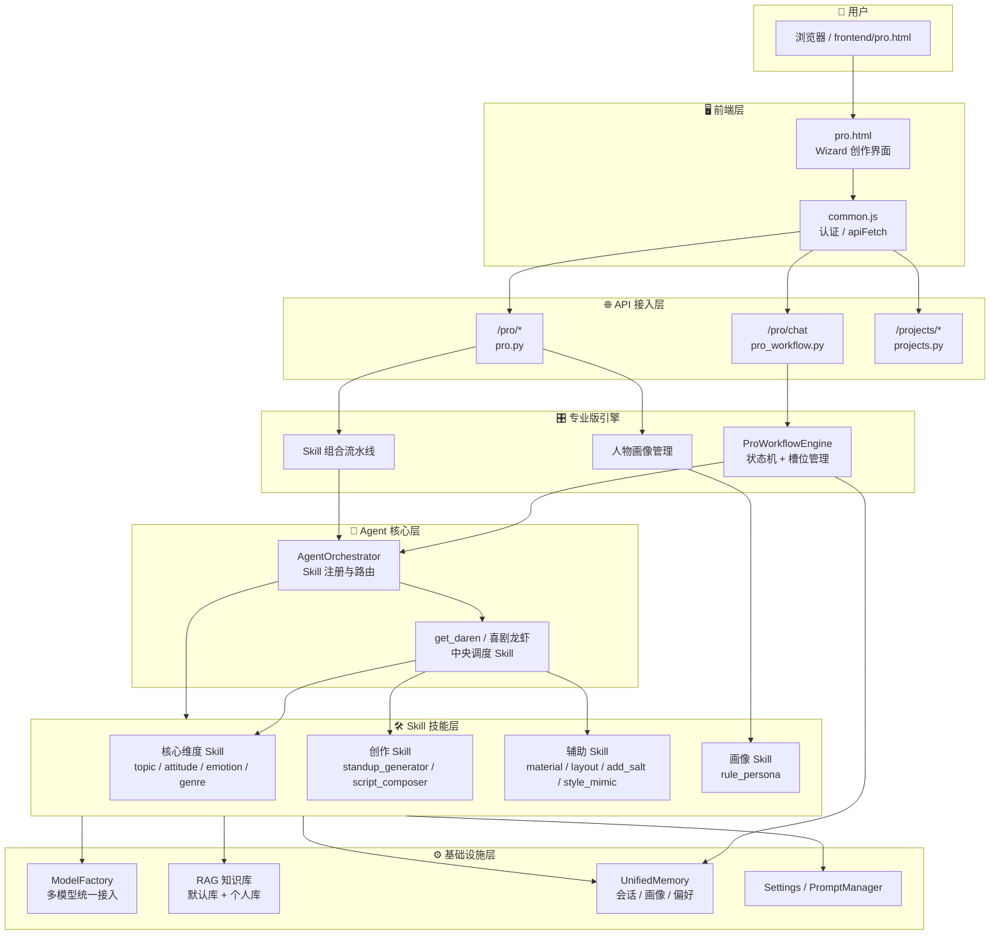
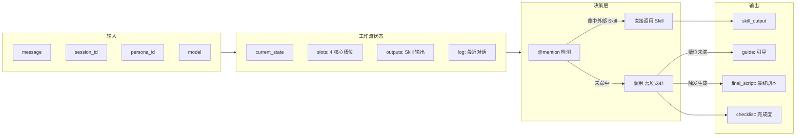
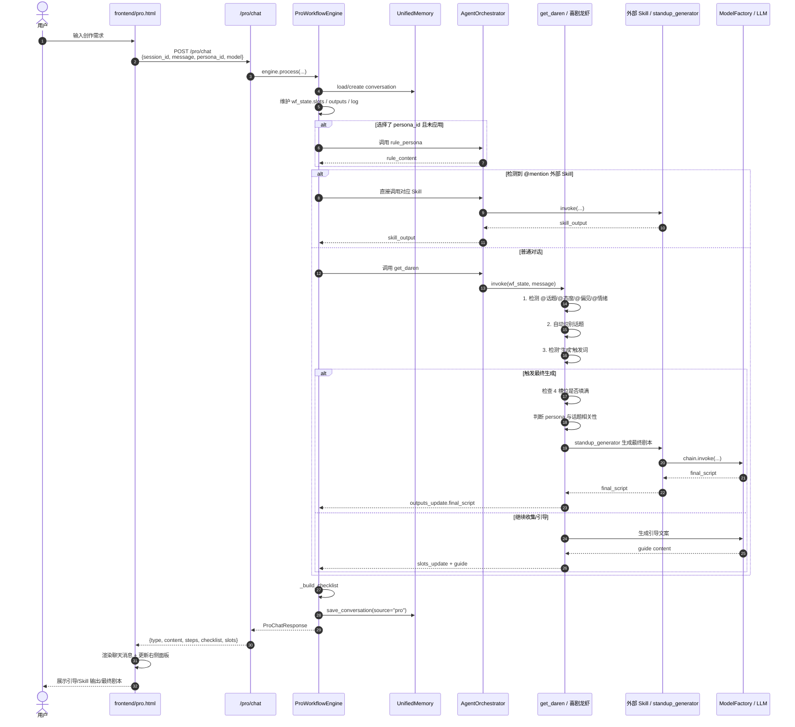
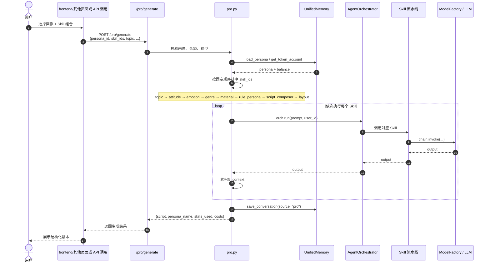

# 专业版（Pro）功能、架构与调用流程

> 整理日期：2026-06-18
> 适用范围：frontend/pro.html、src/comedy_agent/api/routers/pro_workflow.py、src/comedy_agent/api/routers/pro.py、skills/get_daren/ 及相关 Skill

---

## 一、概述

专业版（Pro）是 Comedy Agent 面向**结构化喜剧创作**的 Wizard 工作流模式。与极速版（`/chat`）的"一句话生成段子"不同，专业版通过**中央调度助手"喜剧龙虾"**引导用户逐步完善创作维度，最终生成可交付的剧本/段子。

专业版同时提供两条创作路径：

1. **Wizard 对话式流程**（主路径）：用户通过自然语言对话，逐步填写「话题 / 态度 / 偏见 / 情绪」四个核心槽位，最终触发剧本生成。
2. **直接 Skill 组合流程**（辅路径）：用户选择人物画像 + Skill 组合，后端按固定流水线一次性生成剧本。

---

## 二、专业版功能清单

### 2.1 页面级功能（frontend/pro.html）

| 功能 | 说明 | 代码位置 |
|------|------|----------|
| **Wizard 对话创作** | 左侧聊天区与喜剧龙虾多轮对话，收集创作维度 | L981-1051 |
| **右侧剧本编辑器** | 最终剧本以打字机动画写入右侧编辑器，支持复制/保存/下载 | L311-324, L1174-1217 |
| **模型选择** | 顶部配置栏选择模型，默认优先 deepseek 系列 | L278, L655-672 |
| **人物画像选择/创建** | 选择已有画像或新建画像（含参考文件上传） | L277, L327-344, L1222-1310 |
| **大纲预览** | 展示当前已收集的创作大纲，实际由后端维护 | L276 |
| **@mention 调用 Skill** | 输入 `@` 快速调用素材、排版、风格等外部 Skill | L232-241, L512-520, L554-597 |
| **核心维度快捷按钮** | 团队菜单中展示话题/态度/偏见/情绪/素材/排版卡片 | L333-334, L764-786 |
| **对话历史管理** | 新建对话、加载历史、本地/服务端双重持久化 | L828-866, L919-978 |
| **预算提示** | 根据选中 Skill 显示预估 Token 消耗 | L147-149, L814-825 |
| **分享/下载** | 顶部分享按钮复制链接，下载功能预留 | L1453, L1446 |

### 2.2 后端功能

| 功能 | 说明 | 代码位置 |
|------|------|----------|
| **专业版对话入口** | `/pro/chat`：Wizard 工作流主入口 | pro_workflow.py:721 |
| **会话恢复** | `/pro/chat/{session_id}`：加载历史会话及最终剧本 | pro_workflow.py:754 |
| **人物画像 CRUD** | `/pro/personas`：创建、读取、更新、删除画像 | pro.py:98-202 |
| **可用 Skill 列表** | `/pro/skills`：返回专业版可用 Skill 及分类 | pro.py:221 |
| **参考文件上传** | `/pro/upload`：上传画像参考文件 | pro.py:169 |
| **Token 预估** | `/pro/estimate`：预估 Skill 组合 Token 消耗 | pro.py:264 |
| **直接生成** | `/pro/generate`：按画像 + Skill 组合一次性生成剧本 | pro.py:285 |
| **工作流配置管理** | `/admin/workflow`：查看/修改状态机配置 | pro_workflow.py:794-803 |
| **项目管理** | `/projects`：项目增删改查（与 Pro 创作关联） | projects.py:28-81 |

### 2.3 创作维度与 Skill 能力

| 维度/Skill | 作用 | 触发方式 |
|------------|------|----------|
| **话题** | 创作主题与背景 | 自动识别或 `@话题` |
| **态度** | 评价 + 情绪 + 行动倾向 | `@态度` 或对话填写 |
| **偏见** | 独特视角或非常规观点 | `@偏见` 或对话填写 |
| **情绪** | 情感节奏变化 | `@情绪` 或对话填写 |
| **素材** (`material`) | 从 RSS/网络搜索外部创作素材 | `@素材` |
| **排版** (`layout`) | 按平台格式（公众号/小红书/知乎/B站）排版 | `@排版` |
| **风格** (`genre`) | 全局风格迁移（王家卫/古风/赛博朋克等） | `@风格` |
| **人物画像** (`rule_persona`) | 将画像规则注入生成上下文 | 选择画像后自动应用 |
| **剧本编排** (`script_composer`) | 输出分镜/对白/场景说明的 Markdown 剧本 | `/pro/generate` 流水线 |
| **幽默润色** (`add_salt`) | 按盐度级别润色文本 | Skill 组合中选用 |
| **IP 模仿** (`style_mimic`) | 模仿指定 IP 角色语气 | Skill 组合中选用 |
| **剧本评估** (`script_evaluator`) | 多维度评分与改进建议 | Skill 组合中选用 |

---

## 三、专业版架构

### 3.1 系统分层（Pro 视角）



### 3.2 ProWorkflowEngine 内部结构



### 3.3 数据持久化

| 数据类型 | 存储位置 | 说明 |
|----------|----------|------|
| 会话消息 | SQLite `data/memory.db` → `conversation` 表 | 含 `metadata.workflow` |
| 人物画像 | SQLite `data/memory.db` → `persona` 表 | 规则 + 参考文件 |
| 个人知识库 | ChromaDB `chroma_data/user_knowledge_{uid}` | 上传文档分块 Embedding |
| 默认知识库 | ChromaDB `chroma_data/comedy_knowledge` | 内置喜剧知识 |
| 工作流配置 | `data/pro_workflow.json` | 状态机配置 |
| 上传文件 | `data/uploads/{user_id}/` | 画像参考文件/知识库文件 |

---

## 四、专业版调用流程

### 4.1 Wizard 对话式流程（主路径）



#### 关键步骤说明

1. **前端发起请求**：`sendPrompt()` 收集 `session_id`、`message`、`persona_id`、`model`，调用 `/pro/chat`。
2. **加载/创建会话**：`ProWorkflowEngine.process()` 根据 `session_id` 恢复或新建会话，初始化 `wf_state`。
3. **人物画像注入**：若传了 `persona_id`，自动调用 `rule_persona` 将画像规则写入 `outputs.rule_persona`。
4. **@mention 外部 Skill**：命中 `@素材`、`@排版`、`@风格` 等时，直接调用对应 Skill 返回结果。
5. **喜剧龙虾调度**：未命中外部 Skill 时，调用 `get_daren` 进行核心槽位管理。
6. **槽位自动识别**：
   - `@话题 xxx` 直接填槽
   - 非提问句式且话题为空 → 自动识别为话题
   - 其他槽位通过对话引导填写
7. **最终生成**：用户说"生成"/"完成"/"done"/"finish" 且 4 槽位填满时，调用 `standup_generator` 生成最终剧本；生成前会判断画像规则与话题相关性，避免无关规则污染。
8. **响应渲染**：前端根据 `type`（`guide`/`skill_output`/`final_script`）分别渲染到聊天区或右侧面板。

### 4.2 直接 Skill 组合流程（辅路径）



#### 执行顺序

| 顺序 | Skill | 作用 |
|------|-------|------|
| 1 | `topic` | 话题扩写 |
| 2 | `attitude` | 态度改写 |
| 3 | `emotion` | 情绪注入 |
| 4 | `genre` | 全局风格迁移 |
| 5 | `material` | 外部素材搜索 |
| 6 | `rule_persona` | 应用画像规则 |
| 7 | `script_composer` | 结构化 Markdown 剧本编排 |
| 8 | `layout` | 平台化排版 |

---

## 五、核心数据模型

### 5.1 工作流状态（WorkflowState）

```python
{
    "current_state": "guiding",       # awaiting_outline / awaiting_genre / guiding / aggregating
    "slots": {
        "话题": "...",
        "态度": "...",
        "偏见": "...",
        "情绪": "..."
    },
    "outputs": {
        "rule_persona": "...",
        "final_script": "...",
        "material": "...",
        "layout": "..."
    },
    "log": [                          # 最近 10 轮对话
        {"role": "human", "content": "..."},
        {"role": "ai", "content": "..."}
    ]
}
```

### 5.2 人物画像（PersonaData）

```python
{
    "persona_id": "uuid",
    "name": "毒舌职场侠",
    "description": "...",
    "rule_content": "...",            # 结构化规则文本/JSON
    "reference_files": ["..."],       # 参考文件路径列表
    "is_active": True,
    "usage_count": 0
}
```

### 5.3 响应模型（ProChatResponse）

```python
{
    "session_id": "...",
    "type": "guide",                  # guide / skill_output / final_script / error
    "content": "...",                 # 主展示文本
    "workflow_state": {...},          # 完整工作流状态
    "skill_name": "",                 # 外部 Skill 输出时填充
    "next_actions": [...],            # 快捷操作按钮
    "steps": [...],                   # 多步骤渲染
    "checklist": [...],               # 完成度检查清单
    "slots": {...}                    # 当前槽位值
}
```

---

## 六、关键接口汇总

| 接口 | 方法 | 说明 |
|------|------|------|
| `/models` | GET | 获取可用模型列表 |
| `/pro/personas` | GET/POST | 人物画像列表 / 创建 |
| `/pro/personas/{id}` | GET/PUT/DELETE | 画像详情 / 更新 / 删除 |
| `/pro/upload` | POST | 上传参考文件 |
| `/pro/skills` | GET | 专业版可用 Skill 列表 |
| `/pro/estimate` | POST | Token 消耗预估 |
| `/pro/generate` | POST | 直接 Skill 组合生成 |
| `/pro/chat` | POST | Wizard 对话主入口 |
| `/pro/chat/{session_id}` | GET | 加载历史会话 |
| `/admin/workflow` | GET/PUT | 工作流配置管理 |
| `/projects` | GET/POST | 项目列表 / 创建 |
| `/projects/{project_id}` | GET/PUT/DELETE | 项目详情 / 更新 / 删除 |

---

## 七、相关文件索引

| 类型 | 文件路径 | 说明 |
|------|----------|------|
| 前端页面 | `frontend/pro.html` | 专业版 Wizard 创作界面 |
| 公共请求 | `frontend/common.js` | 认证、apiFetch 封装 |
| 工作流路由 | `src/comedy_agent/api/routers/pro_workflow.py` | `/pro/chat`、ProWorkflowEngine |
| Pro 功能路由 | `src/comedy_agent/api/routers/pro.py` | 画像、Skill、生成、预估 |
| 项目路由 | `src/comedy_agent/api/routers/projects.py` | 项目管理 |
| 中央调度 Skill | `skills/get_daren/skill.py` | 喜剧龙虾 |
| 画像规则 Skill | `skills/rule_persona/skill.py` | 人物画像规则注入 |
| 剧本编排 Skill | `skills/script_composer/skill.py` | 结构化 Markdown 剧本 |
| 脱口秀生成 Skill | `skills/standup/skill.py` | 最终段子生成器（注册名 `standup_generator`） |
| 素材搜索 Skill | `src/comedy_agent/skills/material.py` | RSS/网络搜索素材 |
| 排版 Skill | `src/comedy_agent/skills/layout.py` | 平台化排版 |
| 核心维度 Skill | `skills/topic/`、`skills/attitude/`、`skills/emotion/`、`skills/genre/` | 话题/态度/情绪/风格 |
| 记忆系统 | `src/comedy_agent/memory/unified.py` | 会话/画像/偏好统一接口 |
| 模型工厂 | `src/comedy_agent/models/factory.py` | 多模型接入与降级 |
| Skill 加载器 | `src/comedy_agent/skills/loader.py` | 声明式/代码式 Skill 加载 |

---

## 八、补充说明

### 8.1 与极速版的区别

| 维度 | 极速版（/chat） | 专业版（/pro/chat） |
|------|----------------|---------------------|
| 交互方式 | 单轮/多轮自由对话 | Wizard 引导式对话 |
| 创作维度 | 隐含在 prompt 中 | 显式收集话题/态度/偏见/情绪 |
| 人物画像 | 记忆系统隐式注入 | 显式选择画像并判断相关性 |
| 外部 Skill | Agent 自动路由 | `@mention` 直接调用 |
| 输出形式 | 段子文本 | 右侧编辑器 + 打字机动画 |
| 适用场景 | 快速灵感 | 深度结构化创作 |

### 8.2 异常与降级策略

| 场景 | 处理策略 |
|------|----------|
| 模型调用失败 | `ModelFactory.get_model_with_fallback` 自动切换到备用模型 |
| 知识库检索失败 | 静默跳过，继续生成 |
| `standup_generator` 未注册 | `get_daren` 回退到 LLM 直接聚合 |
| persona 与话题不相关 | 不注入画像规则，避免污染输出 |
| 槽位未填满触发生成 | 返回提示「还有以下维度未填写：...」 |
| 记忆保存失败 | 静默忽略，不影响主响应 |

### 8.3 可扩展点

1. **新增核心维度**：在 `pro_workflow.py` 的 `_CORE_SLOTS` 和 `get_daren` 的 `CORE_SLOTS` 中同步扩展。
2. **新增 @mention Skill**：在 `skills/` 目录下创建 Skill，前端 `/pro/skills` 会自动加载。
3. **自定义工作流状态**：通过 `/admin/workflow` 修改 `data/pro_workflow.json`。
4. **更换最终生成器**：当前 `get_daren` 硬编码调用 `standup_generator`，可扩展为根据 `genre` 槽位选择不同 Skill。
