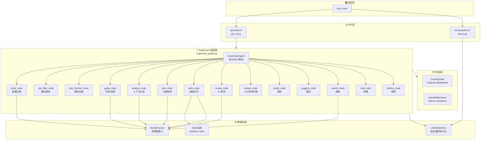
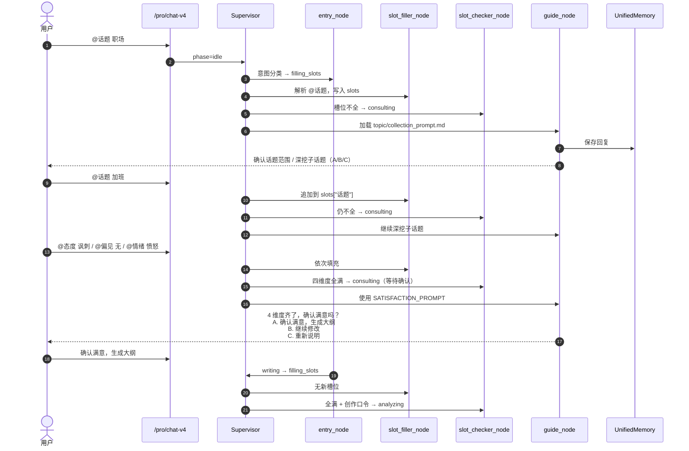
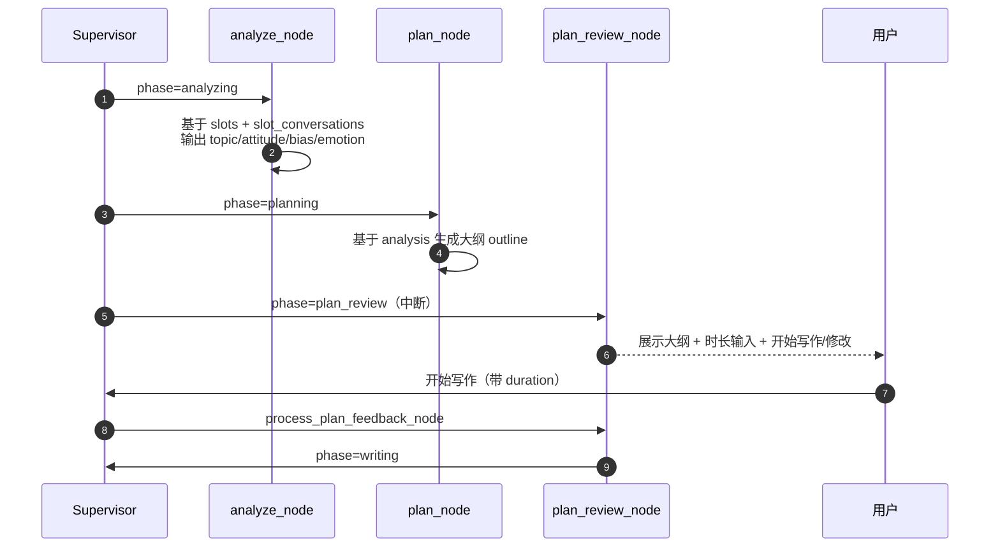
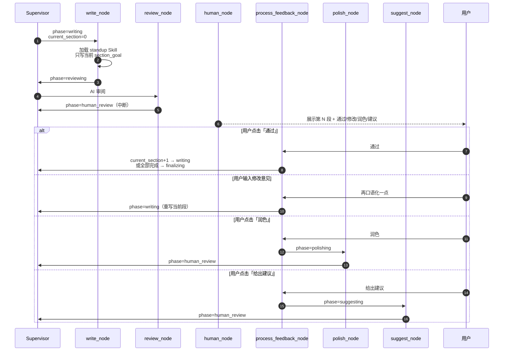
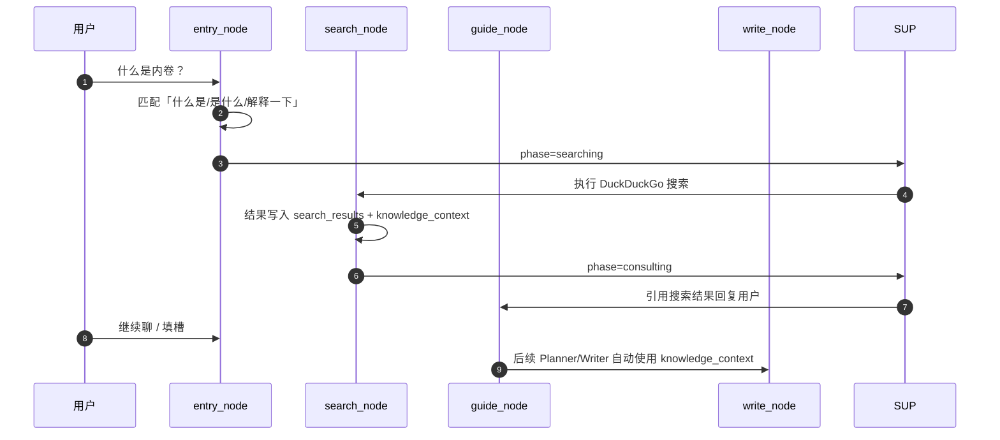

# Comedy Agent v4 架构与各模块工作流说明

> 本文档基于当前 `v3_new` 分支实现整理，描述专业版 B（`pro-b.html` + `/pro/chat-v4`）的多 Agent 协作创作架构与核心工作流。

---

## 一、总体架构

v4 采用 **Supervisor 星型拓扑 + LangGraph StateGraph** 的架构：

- 一个纯代码的 `SupervisorAgent` 根据 `ComedyState.phase` 进行路由；
- 多个 Worker 节点负责具体任务（意图分类、槽位填充、话题引导、上下文分析、大纲规划、逐段写作、审阅、润色、搜索等）；
- 所有 Worker 执行完后回到 Supervisor，由 Supervisor 决定下一步；
- 人类审阅（HITL）通过 `human_node` + `process_feedback_node` 中断与恢复；
- 状态通过 `HybridSqliteSaver` 持久化到 SQLite checkpoint，支持按 `session_id` 恢复。

---

## 二、核心状态：ComedyState

`ComedyState` 是贯穿整个 Graph 的单一状态对象，关键字段如下：

| 字段 | 说明 |
|------|------|
| `phase` | 当前阶段，Supervisor 据此路由 |
| `user_input` | 用户当前输入 |
| `session_id` / `user_id` | 会话与用户标识 |
| `slots` | 四维度槽位：`话题`、`态度`、`偏见`、`情绪` |
| `active_slot_dimension` | 最近一次用户 @ 的维度 |
| `slot_conversations` | 各维度独立对话历史，支持多轮深入 |
| `analysis` | `ContextAnalyzerAgent` 输出的四维度分析 |
| `plan` | `PlannerAgent` 生成的大纲：`todo`、`outline`、`tone` |
| `current_section` / `sections` | 当前段落索引与已完成段落 |
| `feedback` | 人工审阅反馈 |
| `duration` | 预期时长（分钟） |
| `search_results` / `knowledge_context` | 搜索结果与注入知识 |
| `messages` | LangChain 消息链 |
| `response_type` / `suggested_actions` | 前端响应类型与 A/B/C 选项 |

---

## 三、核心工作流

### 3.1 四维度收集与满意确认

要点：

- `SlotFillingAgent` 支持同一维度多次 `@`，用 `；` 拼接并去重，保留多轮记忆；
- `GuideAgent` 在话题维度缺失/刚聊完话题时，加载 `skills/topic/collection_prompt.md` 引导「整体话题 → 子话题 → 确认」；
- 四维度全满后，先由 `GuideAgent` 询问是否满意，用户确认「生成大纲」后才进入分析阶段。

---

### 3.2 大纲生成与确认

要点：

- `ContextAnalyzerAgent` 将四维度槽位总结为结构化 `analysis`；
- `PlannerAgent` 生成 `todo`、`outline`、`tone`；
- `plan_review_node` 通过 LangGraph `interrupt` 暂停，等待用户确认；
- 用户确认后进入 `writing` 阶段。

---

### 3.3 逐段写作与人工审阅

要点：

- `WriterAgent` 每次只生成 `outline[current_section]` 对应的段落；
- `build_prompts` 注入 `section_goal`、`completed_sections`、四维度、时长等变量；
- `skills/standup/SKILL.md` 已改造为逐段写作模式，强调只写当前段、承接已完成段落；
- `human_node` 中断后，用户反馈经 `process_feedback_node` 分发到写作/润色/建议/下一段。

---

### 3.4 未知名词搜索

要点：

- `entry_node` 优先检测 `@填槽`、未知名词询问、创作确认口令，再走 LLM 意图分类；
- `SearchAgent` 返回 `phase=consulting`，并将结果同时写入 `knowledge_context`，供后续创作节点使用；
- `state_modifier.py` 将 `knowledge_context` 注入 Writer/Planner 的 system prompt。

---

## 四、关键模块说明

### 4.1 入口与意图分类

- `entry_node.py`：
  - 快速判定 `@话题/态度/偏见/情绪` → `fill_slot`；
  - 检测「什么是/是什么/解释一下/是什么意思」→ `search`；
  - 检测「生成大纲/开始写作/确认满意」→ `writing`；
  - 其余输入调用 `IntentClassifierAgent` 进行 LLM 分类。
- `intent_classifier.py`：输出 `writing / fill_slot / search / control / feedback / consult / chat`，并映射为对应 `phase`。

### 4.2 槽位系统

- `slot_filler.py`：
  - 解析 `@维度 内容`、`维度：内容`、`我的维度是...` 等多种写法；
  - 同一维度多轮追加，用 `；` 拼接并去重；
  - 将用户输入归档到 `slot_conversations[维度]`，限制 20 轮；
  - 截断槽位值至 500 字符，防止 SQLite blob too big。
- `slot_checker.py`：
  - 槽位不全 → `consulting`；
  - 槽位全满 + 用户明确创作请求/确认口令 → `analyzing`；
  - 槽位全满但未确认 → `consulting`（触发满意确认）。

### 4.3 引导 Agent

- `guide.py`：
  - 槽位缺失时，加载当前 Skill 的 `collection_prompt.md` 或 `skills/topic/collection_prompt.md`；
  - 四维度全满时，使用 `SATISFACTION_PROMPT` 给出「确认满意，生成大纲」等选项；
  - 输出格式固定为「回复 + A/B/C 选项」，前端渲染为可点击按钮。

### 4.4 分析与规划

- `analyze_node.py` / `context_analyzer.py`：基于 `slots` 和 `slot_conversations` 输出结构化 `analysis`；
- `plan_node.py` / `planner.py`：基于 `analysis` 生成创作大纲；
- `plan_review_node.py`：通过 LangGraph `interrupt` 暂停，等待用户确认或修改计划。

### 4.5 写作与审阅

- `write_node.py` / `writer.py`：
  - 加载 `skills/standup/SKILL.md`；
  - 调用 `build_prompts()` 注入段落上下文；
  - 每次只写当前段落，返回 `phase=reviewing`；
  - 所有段落完成后返回 `phase=finalizing`。
- `review_node.py`：AI 审阅当前段落，给出反馈后进入 `human_review`；
- `human_node.py` + `process_feedback_node.py`：处理人工反馈，分发到「通过/修改/润色/建议/人工编辑」。

### 4.6 状态修饰器

- `state_modifier.py`：
  - 组装 BASE_SYSTEM_PROMPT + Skill system_prompt + 示例 + 知识库 + 搜索资料；
  - 渲染 Skill prompt_template，注入 `topic`、`attitude`、`bias`、`emotion`、`duration`、`section_goal`、`completed_sections` 等变量；
  - 兼容 Jinja2 `{{ var }}` 与 Python format `{var}` 两种占位符。

### 4.7 持久化

- `HybridSqliteSaver`：同步/异步 SQLite checkpoint，按 `thread_id = session_id` 保存图状态；
- `UnifiedMemory`：
  - 保存会话记录（`user_conversations` 表，24h TTL）；
  - 支持 `save_conversation` 透传 `slot_conversations`；
  - 保存用户偏好、token 消费、脚本等。

---

## 五、前端交互

`frontend/pro-b.html` 是专业版 B 的主界面：

- 左侧：聊天区，展示多角色对话与 A/B/C 选项按钮；
- 右侧：Artifacts 工作台，展示大纲、段落、最终剧本等卡片；
- 顶部：角色/Skill/模型选择、对话历史入口；
- 历史面板：从 `localStorage` 读取本地记录，支持点击恢复与删除；
- 删除逻辑：
  - 有 `sessionId` 时先调用 `DELETE /conversations/{session_id}`；
  - 后端 404 时仍清理本地记录；
  - 删除当前会话后清空界面。

---

## 六、接口列表

| 接口 | 说明 |
|------|------|
| `POST /pro/chat-v4` | 专业版 B 主接口，接收 message/session_id/skill_id/style/duration |
| `GET /pro/chat-v4/{session_id}` | 获取指定会话当前状态，用于历史恢复 |
| `GET /pro/skills` | 列出可用 Skill |
| `GET /conversations` | 列出当前用户会话 |
| `GET /conversations/{session_id}` | 获取会话详情 |
| `DELETE /conversations/{session_id}` | 删除会话 |

---

## 七、Skill 系统

v4 主要使用声明式 Skill（`SKILL.md`）：

- `skills/standup/SKILL.md`：脱口秀逐段写作 Skill，系统提示词包含逐段规则，prompt_template 注入段落上下文；
- `skills/topic/SKILL.md` + `collection_prompt.md`：话题引导 Skill，分阶段引导用户确定整体话题与子话题；
- `SkillLoader` 解析 `SKILL.md` 为 `SkillConfig`，供 `WriterAgent` 与 `state_modifier.py` 使用。

---

## 八、当前已废弃/保留项

- **保留**：`AI 一键` 写作模式（`manual_section_mode=false`）；
- **保留**：Supervisor 星型图、逐段写作、人工审阅中断；
- **保留**：四维度 `@填槽`、子话题深挖、满意确认；
- **保留**：搜索 Agent 自动触发与结果注入；
- **已废弃/移除**：`样例引导` 与 `教练陪写` 模式；
- **未来可扩展**：中期记忆（写作约定）、长期画像、外部知识库优先级检索。
